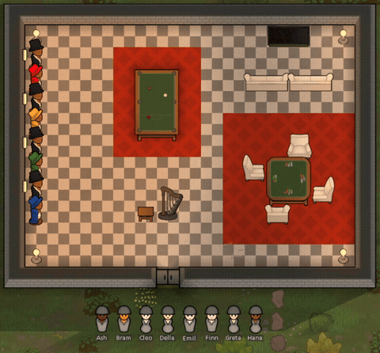

# Shift Change

> **Requires RimWorld 1.6, the Odyssey expansion, and Harmony.** The outfit
> stand this mod builds on is Odyssey content, so without it the mod does
> nothing at all.

A RimWorld mod. Colonists change into the right clothes for the room they are
going to, whether they are there to work or to enjoy themselves, and back out
again afterwards, using the vanilla outfit stand.

Put an outfit stand in a room and put an outfit on it. Each stand dresses for
one of two things:

**Work.** A colonist taking on **automatic** work of that room's kind
(doctoring in the hospital, researching or synthesizing drugs in the lab,
cooking in the kitchen) changes into the stand's outfit before starting, and
changes back when their work takes them elsewhere.

**Recreation.** The same machinery, for a colonist arriving to enjoy
themselves. A frame of billiards, a hand of poker, an hour at the harp. A robe
for the sauna, black tie for the games room.

Their own clothes wait in the stand either way, and come back exactly as they
were, force-worn markers included.


*Three colonists arrive for work in their own clothes, change into what their
room's stand holds, and change back on the way to dinner. Each stand keeps its
borrower's civvies while they are on shift. Sped up 3–6×.*

## How to use it

1. **Build a vanilla outfit stand** (Odyssey) in a hospital, laboratory,
   kitchen, workshop, barn or rec room, and put an outfit on it.
2. That's it, for the common case. The stand reads its room and dresses
   whoever comes to work or to relax there.
3. Optional, per stand:
   - **Shared (set owners)** restricts the stand to the colonists you list.
     Name one and it is their personal kit, off-limits to everyone else; name
     several and it serves that group and nobody outside it. Left unassigned,
     the stand is **shared**: any capable colonist may use whichever stand is
     free, like beds. A kitchen needs one stand per cook *working at once*,
     not one per cook.
   - **The stand's switch**, labelled with what it currently dresses for
     ("Shift stand: doctoring", "Shift stand: recreation", "Not used for
     shift changes"), opens the checklist when the room's reading isn't what
     you want: a multi-purpose room, a room the game scores oddly, a place
     the game doesn't score as recreation at all, or a stand you don't want
     used. The dialog names what the game currently reads the room as, which
     explains the surprises: a crib in a hospital, for instance, makes the
     room a barracks as far as the game is concerned, and the stand goes idle
     until the checklist says otherwise.

**"Change the whole outfit" is off by default, and belongs to the rack rather
than the room.** Normally the kit goes on over whatever it doesn't conflict
with, so a lab coat sits over ordinary clothes. Tick this and the colonist
undresses completely and wears only what the stand holds. That is right for a
sauna robe, wrong for a lab coat. It costs the equip time of every
garment in both directions, and everything their own clothes were providing
comes off with them: warmth, armor, any bonuses those garments carried. They
have exactly what the stand holds and nothing more, which is worth a thought
before putting a robe rack in a cold biome. A stand holding nothing they can
wear still won't undress them; there is no configuration in which a colonist
strips for a shift and gets nothing back.

**"Allow removing items" is held off while a stand is in service.**
Shift changes never need it, and turning it on hands the stand's contents to
every colonist's outfit optimizer, which may take the uniform and wear it as
everyday clothes, and assigning an owner does not prevent that. The stand
clears it on load and again whenever it goes back into service, so a stand
switched on while it was set aside does not stay that way. To take one garment
back, use the eject button beside it in the Contents tab, which drops it next
to the stand. To decommission a stand and let haulers empty it, set "Not used
for shift changes" first; the toggle unlocks with it and stays unlocked.

**"Keep contents out of trade" is on by default.** Traders will otherwise buy
anything sitting on an outfit stand: the uniform, and the owner's own clothes
parked there while they're on shift. That's vanilla behaviour, it reaches both
caravans at the gate and ships in orbit, and nothing else about the stand
prevents it. "Allow removing items" doesn't cover trade, and neither does an
assigned owner. With this on, the stand's contents never reach a trade window,
and nothing else changes: colonists still stock it, shift changes still work,
and you can still load the kit into a caravan yourself. Turn it off for a stand
you keep as a shop shelf; a stand set to "Not used for shift changes" is
tradeable either way.

A stand that is dressing anyone says so in its inspect pane: what it dresses
for, who owns or is currently wearing it, and whether it's empty. A stand in a
room with no role says nothing at all, and behaves like ordinary furniture.

## Dressing for recreation

Tick **Recreation: any joy activity in this room** on a stand and it dresses
whoever comes to that room to enjoy themselves. Everything downstream is the
same: change on the way in, change back on the way out, own clothes waiting in
the stand.



One switch covers all of it, because the room is the selector. A robe stand
dresses for the sauna by standing in the sauna. RimWorld's joy kinds are no
help (a single kind spans prayer, stargazing, building snowmen and visiting a
grave), so a list of activities would only offer you categories your rooms do
not have.

Recreation and work types are mutually exclusive on a stand. A stand holds one
outfit, and one outfit serves one purpose. Tick recreation and the work
checklist goes away; tick any work type and recreation drops. A room that does
both wants two stands.

**Gendered clothing wants an owner list.** A stand serves anyone who can wear
*something* on it. Fine for a lab coat, a trap for a gown: put a prestige robe,
a ladies hat and a formal shirt on a shared stand, and a man will take the robe
and leave the hat. Of Royalty's formal wear the vest and top hat are male, the
ladies hat is female, and the robe and formal shirt are neither.

Owner lists exist for this. **All / Men / Women** filter tabs, an **Assign all**
button, and a stand becomes the women's stand in two clicks, with four
colonists or forty. Whoever is on the list is who it serves.

A stand configures itself from the room here exactly as it does for work: a
hospital gives it doctoring, a kitchen gives it cooking. Only a room scoring as
a rec room turns recreation on by itself, though, and plenty of places people
obviously go to enjoy themselves do not. A throne room scores as a throne room.
A dining room with a chess table in the corner is still a dining room. A room
doing two jobs resolves to whichever one wins, and a pool usually scores as
nothing at all, since swimming happens on terrain rather than furniture. Set
those by hand, once, and they behave like any other recreation stand.

This is also where **Change the whole outfit** earns its keep. A lab coat goes
over ordinary clothes; a sauna robe does not.

### What it deliberately will not do

- **Drinking and drug-taking are invisible to it.** Fetching a beer runs the
  same job whether it ends at a bar or in a corridor, and nothing in that job
  says recreation, so nothing dresses anyone for it. Sitting down to socialise
  at a table or a counter *is* caught, and the drink comes along.
- **Reading is left alone.** A colonist picks their reading spot after setting
  off. The only room known at the start is wherever the book sits on a shelf,
  and dressing them for the library because that is where the novel lives would
  be the wrong room.
- **Outdoors is excluded, for now.** Every outdoor cell on the map belongs to
  one enormous room, so a recreation stand in open ground would dress
  colonists for every walk and every bit of stargazing anywhere on the map. A
  walled but roofless yard is its own room and still counts. Serving open
  ground needs a boundary of its own: a zone, or a radius around the stand.
  That is planned.
- **Nobody is pulled out of bed.** Vanilla hands patients recreation they can
  take lying down precisely so they stay put.
- **A drink from the rec room's own stock does not end the visit.** The
  meal-break rule below is a work-room rule, and a rec room stocks its own bar.

## The rules it follows

Deliberately narrow, so it never fights you:

- **Automatic only**, for work and recreation alike. Right-click orders
  execute immediately, in both directions: a doctor ordered to tend *right
  now* goes straight there, and a pawn in uniform given a direct order keeps
  it on and returns it later.
- **Emergencies are never delayed.** A colonist bleeding out is not kept
  waiting for a wardrobe trip.
- **Nothing happens while the map is under threat.**
- **Personal kit stays personal.** A stand with owners serves only them,
  nobody takes clothes out of a stand someone else is using, and whoever
  checked a uniform out is whom it goes back to.
- Passing through a room changes nothing; only doing the room's work does.
- **A meal break gets them out of uniform first**, wherever the food is
  stored. The exception is food already in their hands or their pack: that
  they just eat. Otherwise a cook would carry a meal across the base in
  whites to reach a chair, which is the walk this mod exists to prevent.
- If a stand frees up while someone is already working in its room out of
  uniform, they'll step over and change, unless they're mid-treatment on a
  patient.
- **Change back** appears on any colonist currently in a uniform, for when
  you want them out of it now: a raid, say, since they will not change back
  on their own while the map is under threat.

One mod setting: **"Unassigned stands are shared"** (default on). Turn it off
and only stands with an explicit owner list ever dress anyone.

## Requirements

- RimWorld 1.6
- **Odyssey** (the outfit stand is Odyssey content)
- Harmony

The kid outfit stand (Biotech) is not used, by design.

## Mod compatibility

**[Outfit Stands Plus](https://steamcommunity.com/workshop/filedetails/?id=3545172389)**
works alongside this mod, in either load order (tested with both). The two
divide a stand cleanly: its mechanized and mending stands are full shift
stands here (shift changes run at their boosted swap speeds, and the mending
stand repairs a borrower's parked clothes while they work), and each stand
shows exactly one Set owner control: this mod's while the stand is in
service, theirs when the stand is set to "Not used for shift changes". Its
wardrobe features, its "allow adding items" toggle and its research are all
untouched.

Two of its behaviours are worth knowing about, because they can look like
faults here: it switches off its own "allow adding items" after a manual
swap, which quietly stops haulers restocking that stand until it is switched
back on; and its right-click "Return to stand", used on a colonist who is
mid-shift, moves clothes the shift system was tracking. Nothing is lost,
and the next change-back sorts it out, but the walk is wasted.

**[Gerrymon's Hotspring Expanded](https://steamcommunity.com/sharedfiles/filedetails/?id=3717051546)**
needs no setup. Its private and public pool rooms are named in the room table,
so a stand in one turns itself on for recreation the same way a hospital turns
one on for doctoring.

**[Standalone Hot Spring](https://steamcommunity.com/sharedfiles/filedetails/?id=2205980094)**
works too, and for the general reason rather than a special case: its bathing
job carries a joy kind, which is the whole of what the trigger looks for. Any
modded recreation that does the same is caught. Its room does not score as a
pool, though, so that stand takes the switch by hand.

**An apparel mod is worth having.** Not required and not a dependency, but
vanilla has no scrubs, no lab coat and no chef's whites, so in a pure vanilla
game there is very little to actually dress anyone *in*. Any apparel mod fixes
that; [Vanilla Apparel Expanded](https://steamcommunity.com/sharedfiles/filedetails/?id=1814987817)
adds exactly those three and is what all the footage here uses.

## Save safety

Add it to an existing save freely: your existing outfit stands gain the new
controls on load, nothing needs rebuilding. Removing it is also safe: stands
revert to ordinary vanilla furniture, and a colonist who was mid-shift simply
keeps the uniform (**Clear forced apparel** on the Assign tab un-forces it)
with their own clothes waiting in the stand.

## Status

Live on the [Steam Workshop](https://steamcommunity.com/sharedfiles/filedetails/?id=3783456242).
Played daily in a live colony, and the lifecycle paths that are impractical
to arrange by hand (gravship flights, death, banishment, repeated faults)
are covered by an automated harness (`devtools/run-harness.sh`) that runs
before every release.

## How this is built

This mod is built with AI assistance and it is worth being precise about where.

**The code, the defs and these documents** are written with
[Claude Code](https://claude.com/claude-code). The repository is MIT-licensed
and contains all of it, so none of this has to be taken on trust.

**All the art here is captured in game.** The mod itself ships no textures and
no apparel of any kind. It adds behaviour to a building the base game already
draws, its icons come from vanilla's own UI atlas, and the only image inside the
mod folder is the Workshop preview, which is a screenshot.

Everything else is a screenshot or a screen recording of RimWorld running this
mod, cropped and composited with ImageMagick and ffmpeg. The sets were built by
the debug fixtures in `Source/`, so they rebuild on demand, and
[media/README.md](media/README.md) records the crops, ramps and timings that
produced each one. No diffusion model and no image pipeline are involved
anywhere.

**The engine claims are checkable.** Every assertion in
[docs/DESIGN.md](docs/DESIGN.md) about how RimWorld behaves cites the decompiled
assembly by file and line, at a stated game version.

**Some of it was found in play, and some of it was not.** The reservation carry,
the forced-flag capture, the optimizer pause and the recolor guard are all fixes
for things that went wrong in a live colony. Others never surfaced that way and
were caught by reading the decompiled engine instead, including one that had
been running unnoticed on the demo film set for days. Both kinds are real, and
neither method finds the other's.

**The behaviour is tested, and you can run the tests.**
`devtools/run-harness.sh` runs a suite inside RimWorld itself, against the real
engine rather than mocks, in about thirty-five seconds (game launch, mod
load and quit included). Cases arrive from four
places: a bug that happened, a claim this page makes, an engine behaviour worth
pinning down before an update moves it, and a feature that shipped with its own.
The standing rule is that anything which goes wrong leaves a case behind that
fails without its fix. It does not cover everything:
[docs/TESTING.md](docs/TESTING.md) says plainly what it does not, and play
observation is still required.

## For modders

| Doc | Contents |
|---|---|
| [docs/DESIGN.md](docs/DESIGN.md) | What the mod interfaces with inside the game and why each piece took its shape: the job-interception point and its traps, what the vanilla stand does and does not provide, the ownership and forced-apparel lifecycles, room-role scoring, the state model. Assumes programming, not RimWorld modding. |
| [docs/DEVELOPMENT.md](docs/DEVELOPMENT.md) | Build, engine navigation, the hot-reload rig and the rules it imposes, CI, file map. |
| [docs/TESTING.md](docs/TESTING.md) | What the test suite covers, what it deliberately does not, the rules it follows, and two engine traps it had to pay for. |
| [AGENTS.md](AGENTS.md) | Short form of the invariants, for coding agents. |

## Building from source

```
dotnet build Source/ShiftChange/ShiftChange.csproj -c Release
```

Output goes to `Assemblies/`, which must contain only `ShiftChange.dll`; the
game loads every DLL it finds there, and all package references are
compile-time only. A `-c Debug` build additionally wires in a hot-reload rig
for UI iteration (dev use only; see [docs/DEVELOPMENT.md](docs/DEVELOPMENT.md)).
Always build Release before shipping or committing, which also sweeps the dev
artifacts.

## Credit

[Automatic Swap Outfit](https://github.com/aedbia/AutomaticSwapForStand) by
aedbia (MIT) covers adjacent ground: automatic swapping at an outfit stand,
triggered by allowed-area boundaries. Shift Change is an independent
implementation with a different trigger (the room and its work type) and
per-stand ownership, but that mod is why several dead ends were cheap to
avoid.

## License

MIT. See [LICENSE](LICENSE).

Portions of the materials used to create this content/mod are trademarks and/or
copyrighted works of Ludeon Studios Inc. All rights reserved by Ludeon. This
content/mod is not official and is not endorsed by Ludeon.
