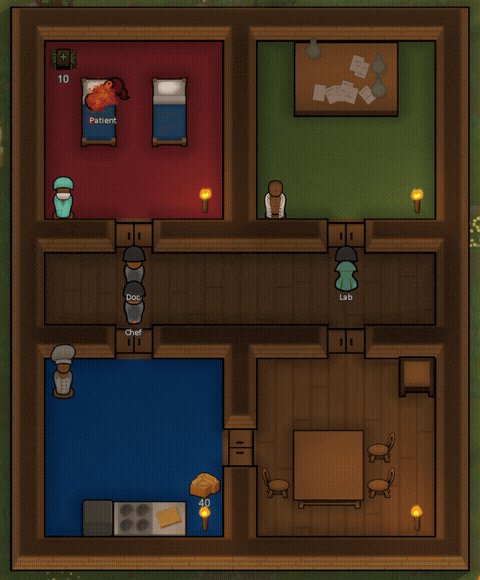

# Shift Change

> **Requires RimWorld 1.6, the Odyssey expansion, and Harmony.** The outfit
> stand this mod builds on is Odyssey content, so without it the mod does
> nothing at all.

A RimWorld mod. Colonists change into the right clothes for the room they work
in, and back out again afterwards — using the vanilla outfit stand.

Put an outfit stand in a work room and put an outfit on it. When a colonist
takes on **automatic** work of that room's kind — doctoring in the hospital,
researching or synthesizing drugs in the lab, cooking in the kitchen — they
change into the stand's outfit before starting, and change back when their
work takes them elsewhere. Their own clothes wait in the stand, and come back
exactly as they were, force-worn markers included.



*Three colonists arrive for work in their own clothes, change into what their
room's stand holds, and change back on the way to dinner. Each stand keeps its
borrower's civvies while they are on shift. Sped up 3–6×.*

## How to use it

1. **Build a vanilla outfit stand** (Odyssey) in a work room — hospital,
   laboratory, kitchen, workshop or barn — and put a work outfit on it.
2. That's it, for the common case. The stand reads its room and dresses
   whoever comes to work there.
3. Optional, per stand:
   - **Shared (set owner)** reserves the stand for one colonist — their
     personal kit, off-limits to everyone else. Left unassigned, the stand is
     **shared**: any capable colonist may use whichever stand is free, like
     beds. A kitchen needs one stand per cook *working at once*, not one per
     cook.
   - **Set work types** opens a checklist when the room's reading isn't what
     you want — a multi-purpose room, a room the game scores oddly, or a
     stand you don't want used at all ("Not used for shift changes").

**Leave "Allow removing items" off** — its default. Colonists stock the stand
either way, and shift changes ignore the setting completely, so nothing here
needs it on. Turning it on is the one way to make a stand misbehave: it hands
the stand's contents to every colonist's outfit optimizer, which may take the
uniform and wear it as everyday clothes.

A stand that is dressing anyone says so in its inspect pane: what work it
dresses for, who owns or is currently wearing it, and whether it's empty. A
stand in a room with no work role says nothing at all, and behaves like
ordinary furniture.

## The rules it follows

Deliberately narrow, so it never fights you:

- **Automatic work only.** Right-click orders execute immediately, in both
  directions — a doctor ordered to tend *right now* goes straight there, and
  a pawn in uniform given a direct order keeps it on and returns it later.
- **Emergencies are never delayed.** A colonist bleeding out is not kept
  waiting for a wardrobe trip.
- **Nothing happens while the map is under threat.**
- **Personal kit stays personal.** Nobody takes clothes out of a stand
  someone else is using; whoever checked a uniform out is whom it goes back
  to.
- Passing through a room changes nothing — only doing the room's work does.
- **A meal break gets them out of uniform first**, wherever the food is
  stored. The exception is food already in their hands or their pack: that
  they just eat. Otherwise a cook would carry a meal across the base in
  whites to reach a chair, which is the walk this mod exists to prevent.
- If a stand frees up while someone is already working in its room out of
  uniform, they'll step over and change — unless they're mid-treatment on a
  patient.
- **Change back** appears on any colonist currently in a uniform, for when
  you want them out of it now — a raid, say, since they will not change back
  on their own while the map is under threat.

One mod setting: **"Unassigned stands are shared"** (default on). Turn it off
and only stands with an explicit owner ever dress anyone.

## Requirements

- RimWorld 1.6
- **Odyssey** — the outfit stand is Odyssey content
- Harmony

The kid outfit stand (Biotech) is not used, by design.

**An apparel mod is worth having.** Not required and not a dependency, but
vanilla has no scrubs, no lab coat and no chef's whites, so in a pure vanilla
game there is very little to actually dress anyone *in*. Any apparel mod fixes
that; [Vanilla Apparel Expanded](https://steamcommunity.com/sharedfiles/filedetails/?id=1814987817)
adds exactly those three and is what all the footage here uses.

## Save safety

Add it to an existing save freely — your existing outfit stands gain the new
controls on load, nothing needs rebuilding. Removing it is also safe: stands
revert to ordinary vanilla furniture, and a colonist who was mid-shift simply
keeps the uniform (**Clear forced apparel** on the Assign tab un-forces it)
with their own clothes waiting in the stand.

## Status

Release candidate. Played for days in a live colony, and the lifecycle
paths that are impractical to arrange by hand — gravship flights, death,
banishment, repeated faults — are covered by an automated harness
(`devtools/run-harness.sh`).

## How this is built

This mod is built with AI assistance and it is worth being precise about where.

**The code, the defs and these documents** are written with
[Claude Code](https://claude.com/claude-code). The repository is MIT-licensed
and contains all of it, so none of this has to be taken on trust.

**There is no generated art, because there is no art.** The mod ships no
textures and no apparel of any kind — no diffusion model, no image pipeline. The
only PNG in the mod folder is the Workshop preview, a screenshot of the game. It
adds behaviour to a building the base game already draws, and its icons come
from vanilla's own UI atlas. That was a deliberate scoping choice before it was
anything else, and it happens to remove the question entirely.

**The engine claims are checkable.** Every assertion in
[docs/DESIGN.md](docs/DESIGN.md) about how RimWorld behaves cites the decompiled
assembly by file and line, at a stated game version.

**Some of it was found in play, and some of it was not.** The reservation carry,
the forced-flag capture, the optimizer pause and the recolor guard are fixes for
things that went wrong in a live colony. But an adversarial review of the whole
codebase later found three release blockers that days of play had not — one of
them had been running unnoticed on the demo film set — and those were caught by
reading the engine, not by playing. Both kinds of bug are real. Neither method
catches the other's.

**The behaviour is tested, and you can run the tests.**
`devtools/run-harness.sh` runs a suite inside RimWorld itself, against the real
engine rather than mocks, in about twenty seconds. Every bug found in that review
now has a case that fails without its fix, and the rules listed further up this
page are asserted against the code rather than only written down. It does not
cover everything — [docs/TESTING.md](docs/TESTING.md) says plainly what it does
not, and play observation is still required.

## For modders

| Doc | Contents |
|---|---|
| [docs/DESIGN.md](docs/DESIGN.md) | What the mod interfaces with inside the game and why each piece took its shape: the job-interception point and its traps, what the vanilla stand does and does not provide, the ownership and forced-apparel lifecycles, room-role scoring, the state model. Assumes programming, not RimWorld modding. |
| [docs/DEVELOPMENT.md](docs/DEVELOPMENT.md) | Build, engine navigation, the hot-reload rig and the rules it imposes, CI, file map. |
| [docs/TESTING.md](docs/TESTING.md) | What the test suite covers, what it deliberately does not, the rules it follows, and two engine traps it had to pay for. |
| [AGENTS.md](AGENTS.md) | Short form of the invariants, for coding agents. |

## Building from source

```
dotnet build Source/ShiftChange/ShiftChange.csproj -c Release
```

Output goes to `Assemblies/`, which must contain only `ShiftChange.dll` — the
game loads every DLL it finds there, and all package references are
compile-time only. A `-c Debug` build additionally wires in a hot-reload rig
for UI iteration (dev use only; see [docs/DEVELOPMENT.md](docs/DEVELOPMENT.md)).
Always build Release before shipping or committing, which also sweeps the dev
artifacts.

## Credit

[Automatic Swap Outfit](https://github.com/aedbia/AutomaticSwapForStand) by
aedbia (MIT) covers adjacent ground — automatic swapping at an outfit stand,
triggered by allowed-area boundaries. Shift Change is an independent
implementation with a different trigger (the room and its work type) and
per-stand ownership, but that mod is why several dead ends were cheap to
avoid.

## License

MIT — see [LICENSE](LICENSE).

Portions of the materials used to create this content/mod are trademarks and/or
copyrighted works of Ludeon Studios Inc. All rights reserved by Ludeon. This
content/mod is not official and is not endorsed by Ludeon.
