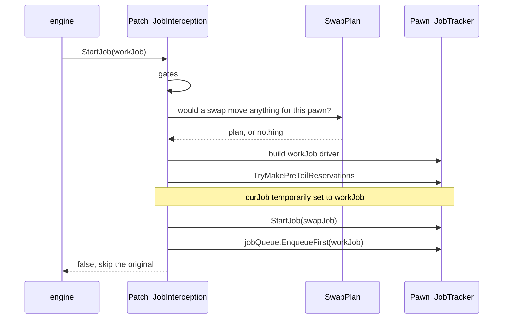
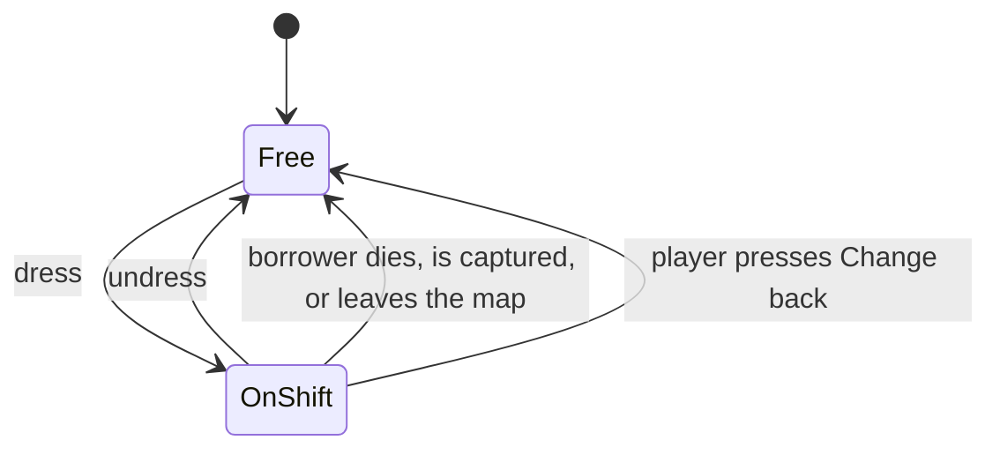

# Design

What this mod interfaces with inside RimWorld, and why each interface took the
shape it did. For build and debug, see [DEVELOPMENT.md](DEVELOPMENT.md).

Engine claims were checked against the decompiled game assembly, version
**1.6.4871**. References like `Pawn_JobTracker.cs:338` point into that
decompilation. Line numbers drift across game versions; method names drift much
more slowly.

No RimWorld modding experience assumed. The primer below covers everything the
rest of the document uses.

## What it does

A vanilla outfit stand placed in a work room dresses colonists for that room's
work. When a colonist takes an **automatic** job whose work type matches the
stand's and whose target is in the stand's room, they change into the stand's
outfit, do the work, and change back when their next job takes them elsewhere.

The mod ships no art and no apparel. It adds behaviour to an existing vanilla
building.

## Constraints

| Constraint | Consequence |
|---|---|
| Automatic work only | A player-forced job is a direct order. Sending the pawn to a wardrobe first makes orders feel broken. Applies in both directions. |
| The room is the boundary | Ties the uniform to where the work is, so a pawn is never far from their civvies in a crisis. An unbounded "always wear X for work Y" mode reintroduces that distance and was rejected. |
| Zero new art | Ownership is patched onto the vanilla def rather than shipped as a new building. Icons come from vanilla's UI atlas. |
| Fail open | This patches the method that starts every job for every pawn. An unhandled exception there is a bricked colony. Every hook catches, logs once, disables the mod for the session, and lets vanilla proceed. |

## RimWorld in five concepts

1. **Defs and XML patches.** Game content is XML (`ThingDef`, `JobDef`,
   `WorkGiverDef`), loaded into a global database at startup. A mod adds its own
   defs or patches others', vanilla included. Shift Change adds one `JobDef` and
   patches two components onto the outfit stand.
2. **Comps.** A `ThingComp` attaches to a thing via its def. Composition, not
   inheritance. Comps tick, save state, contribute gizmos and inspect text.
   Attaching one by XML patch gives a vanilla building modded behaviour without
   replacing its class.
3. **The job system.** Pawns decide what to do via a **think tree**. For work it
   walks the pawn's priorities and asks each **WorkGiver** to scan for something
   to do. A WorkGiver produces a **Job**, which `Pawn_JobTracker.StartJob` turns
   into a running **JobDriver**, a state machine of toils. Starting a job
   **reserves** its targets.
4. **Harmony.** The runtime patching library. Prefixes, postfixes, transpilers.
   A prefix returning `false` skips the original method.
5. **Scribing.** The save system. Objects write fields via `Scribe_*.Look`.
   Unrecognized fields are silently skipped on load, which is what makes
   "remove the mod, keep the save" work.

## Interception

A Harmony prefix on `Pawn_JobTracker.StartJob`.

The decision needs three facts: the job's **work type**, whether it was
**player-forced**, and its **target location**. All three are readable at
`StartJob` — the assigning code has already attached the `WorkGiverDef` (whose
`workType` field is the work type), the `playerForced` flag and the targets.

### Why not TryOpportunisticJob

The nearest prior-art mod hooked `Pawn_JobTracker.TryOpportunisticJob`, the slot
vanilla uses to insert "haul something on your way" jobs. It is called from
inside `StartJob` for every job (`Pawn_JobTracker.cs:338`) and its contract is
"return a job to do first". It is unusable twice over:

- Vanilla bails out for drafted pawns and several other states
  (`CanPawnTakeOpportunisticJob`, `Pawn_JobTracker.cs:626-649`).
- It fires only if the incoming job's def sets `allowOpportunisticPrefix`
  (`:657`). 164 of 321 JobDefs do, and `TendPatient` is not among them
  (`Jobs_Work.xml:370-375`). Doctoring is unreachable through that hook.

The prior-art mod's source contains a commented-out line forcing the flag.

### Inserting a job ahead of another

The pattern is vanilla's own. When vanilla inserts an opportunistic haul it
starts the other job and puts the displaced job at the front of the pawn's queue
(`Pawn_JobTracker.cs:331-347`).

Two details matter:

- **Start the swap first, enqueue second.** If starting the swap throws and the
  original were already queued, the fail-open catch would let the original also
  start, putting one Job object in two places. `StartJob` never reads the queue,
  so enqueueing after is equivalent on success and safer on failure.
- **Re-entrancy.** Starting a job from inside a `StartJob` prefix re-enters the
  prefix. A static guard makes the inner call pass through.

### Deferred jobs carry their reservations

Vanilla reserves a job's targets inside `StartJob`, and the prefix skips the
original. Without more, the deferred job's targets sit unreserved for the whole
walk-and-change and another pawn's work scan can take them. In play this looked
like a distant doctor dressing for a patient a nearer doctor had already tended,
then changing straight back.

Vanilla's opportunistic path reserves first, then enqueues, and does not release
(`Pawn_JobTracker.cs:331-347`). Shift Change does the same: build the deferred
job's driver, call `TryMakePreToilReservations`, then start the swap. Safe to
copy because vanilla's queue plumbing releases a queued job's reservations on
every clearing path (`QueuedJob.Cleanup` → `ClearReservationsForJob`,
`QueuedJob.cs:24-33`), and a queued job re-reserving its own targets is
idempotent.

The dry run has to happen with `curJob` temporarily set to the deferred job.
Vanilla assigns `curJob` before calling `TryMakePreToilReservations`, and drivers
rely on it: `JobDriver_SocialRelax` reserves its seat against `pawn.CurJob`, not
its own job field (`JobDriver_SocialRelax.cs:30`). With `curJob` unset the
reserve sees a null job, fails with a "without a valid job" warning
(`ReservationManager.cs:306-309`), and the divert silently degrades into
ride-along. In play, a crafter drank at a bar in uniform.

### The gates

The prefix declines to act when:

| Gate | Why |
|---|---|
| drafted, downed, or in a mental state | being told where to be, or not themselves |
| map danger ≠ None | **dressing only** — see below. No vanilla precedent to copy: `JobGiver_OptimizeApparel` has no danger check; vanilla gets apparel-change safety from think-tree position (`Humanlike.xml:302-306`), and this hook sits downstream of the think tree |
| `job.playerForced` | direct orders execute immediately, in both directions. A pawn in uniform given a forced order keeps it on and returns it later |
| `workGiverDef.emergency` | emergency givers exist because something cannot wait (`DoctorTendEmergency`). A bleeding pawn must not wait for a wardrobe trip |
| `pawn.GetLord()` or `mindState.duty` | a lord holds the pawn and reissues their job on its own clock, so a swap is pre-empted rather than finished. Both directions — see below |
| the pawn's current job is the swap | never stack a swap on a swap, whatever handed them the new job |

The forced and emergency exemptions originally gated only the dressing path.
Play showed the return trip could delay an emergency identically, so both were
hoisted above each direction.

The duty gate is the same argument as the danger gate, arriving late.
`Humanlike.xml` puts the lord directive nodes at `:112` (`HighPriority`) and
`:288` (`MediumPriority`) and `JobGiver_OptimizeApparel` at `:306`, so a duty
that issues a job takes it at one of the first two and the pawn never reaches
the apparel node. Where the node is reached, vanilla still does not defer the
apparel job: it carries `leaveJoinableLordIfIssuesJob`, so changing clothes
leaves a voluntarily joinable lord rather than waiting for it. Both levers
belong to the tree. From below it this hook has neither — it cannot make its
own swap unreachable, and walking a pawn out of a ritual is not its call — so
it declines instead, which is broader than vanilla by one case: a partygoer
whose duty issues no job could have changed, and left the party doing it, and
now stays in what they are wearing until the lord ends. One wardrobe trip
deferred, against the alternative of guessing which lords are safe to walk a
colonist out of. Found in play
when a colonist was pulled into a modded art exhibit: the return trip fired as
the ritual took her out of her work room, the lord replaced the half-finished
swap on its next duty update, and that fresh duty job arrived at the prefix to
be deferred again. Thirty-four queued jobs, one per programme piece, and a
colonist stood on "changing clothes" for the length of the show. The trade was
never available — a completed change was not on offer, only a stranded pawn.

It cannot latch a colonist out of the mod: `Lord.Cleanup`, `RemovePawn` and
`RemoveAllPawns` each clear `mindState.duty` and `pawn.lord` together, so the
next ordinary job changes them back the usual way. `duty` is tested beside the
lord because a mod can leave one on a pawn with no `Lord` of its own.

The swap-in-progress gate is the general form of the same failure: whatever
pre-empts a swap in flight, deferring the replacement starts a second swap and
pushes the first one's displaced job deeper down the queue. `TryDressMidJob`
carries the duty check too — its job filter rejects a job that is not casually
interruptible, but a duty job is not obliged to say so.

The danger gate went the other way, and for the same reason: read the
directions separately. It sat above both arms, which made a raid a freeze
rather than a pause — every borrower stayed in costume for its duration, and
since nothing fires on the way back to `None`, anyone whose next job was a long
one wore it well past the all-clear. Found in play: four colonists spent a raid
in evening dress with their flak vests and helmets parked in a full-change
recreation stand, and the gate meant to protect them was the reason they could
not go and get them. It now sits **below the return trip and above both dress
arms**, so it means "no changing in" rather than "no changing". Changing in is
a detour nobody should take mid-firefight; changing back is a pawn moving
toward their own gear. Nothing reacts to danger *starting* — a raid never yanks
anyone to a wardrobe. `TryDressMidJob` keeps its own copy of the check
unchanged, being a dress path already.

### Meal breaks

An ingest job's `targetA` is the food, and the chew spot is chosen mid-job
(`Toils_Ingest.CarryIngestibleToChewSpot`), so the return trip's room test cannot
see where eating will happen. A cook grabbing a meal stored in the kitchen walked
to the dining room in whites.

Ingest-family jobs are therefore identified by driver class and bypass the room
test: food already on the pawn means no divert, eat as-is; anything else means
change out first, wherever the food is stored.

## Building_OutfitStand

Used as-is, with two comps patched onto its def and its container API called from
the swap driver.

The def is patched as a **commons**: the `<comps>` node is ensured
first and appended into second, because other mods add comps to this same def —
Outfit Stands Plus does — and a def left with two `<comps>` nodes is resolved
last-wins with a red "defines the same field twice" error, deleting whichever
mod's node came first. For the same reason our assignable comp scribes
mod-prefixed keys (comps scribe flat into the thing's save node, so two
`CompAssignableToPawn` subclasses writing vanilla's generic `assignedPawns`
cross-read on load), and every lookup of our assignable comp is exact-type first
(`TryGetComp<CompAssignableToPawn_ShiftStand>`) with a base-typed fallback — comp
order, which follows patch order, decides nothing.

| Vanilla provides | Detail |
|---|---|
| Apparel storage with filters | storage-group support, contents displayed on the stand model |
| `allowRemovingItems`, default false | one flag driving both `IHaulSource.HaulSourceEnabled` and `IApparelSource.ApparelSourceEnabled` (`:102-104`). This default is what stops haulers carting uniforms to stockpiles and stops `JobGiver_OptimizeApparel` raiding the stand. It does not reach traders — see [Withholding from trade](#withholding-from-trade) |
| One outfit of capacity, structurally | `HasRoomForApparelOfDef` (`:332-342`) is not a count limit but a conflict check, refusing anything that cannot be worn together with what is already there |
| Eviction | `TryDropThingsToMakeRoomForThingOfDef` (`:344-364`) drops conflicting contents on the floor nearby |

The capacity fact is load-bearing. A stand is one outfit's worth, full stop,
which killed the "shared stand holding several pawns' sets" design at the root:
not untidy, physically impossible. Ownership follows from capacity.

Eviction is the entire "dead owner's clothes" story. Abandon the ledger, leave
the garments as ordinary contents, and the next user's first deposit evicts them
for haulers to collect. No custom reclaim logic exists because none is needed.

What vanilla does not provide:

- **Any concept of whose clothes are inside.** The stand scribes its container,
  settings and the toggle, nothing else (`:878-885`). It is a shared bag.
- **A usable swap.** `JobDriver_UseOutfitStand` is anonymous: it claims every
  wearable item for whoever arrives (`:38-63`) and pushes their displaced clothes
  back into the same undifferentiated bag (`:83-96`). Two pawns sharing one stand
  walk off in each other's clothes. It also force-flags everything it hands out
  (`:91`), including street clothes on the way back, whether or not they were
  force-worn before. Both properties made it unusable as a return trip.

## Ownership and the ledger

`CompAssignableToPawn` is the ownership machinery beds and thrones use, and it is
XML-attachable: the "Set owner" gizmo, the assignment dialog, reference scribing
and stale-owner cleanup all come with it (`CompAssignableToPawn.cs:164-195`). The
subclass narrows candidates to pawns capable of the stand's work types and
renames the gizmo. The base comp never displays the owner anywhere; beds only
appear to because `Building_Bed` writes it into its own inspect string.

Patching onto the vanilla def means existing stands in existing saves gain the
gizmo on load. The cost is discipline about touching a shared building.

> **Hotkey collision.** The base comp hardcodes its gizmo to `Misc4`
> (`CompAssignableToPawn.cs:176`), which is **N**. Harmless on beds. The outfit
> stand is a *storage* building, and the settings clipboard binds copy to the same
> `Misc4`/N (`StorageSettingsClipboard.cs:40`). Reusing a vanilla comp on a
> building category it never shipped on can import a hotkey collision. The
> subclass strips the binding.

**Unassigned means pooled.** Any capable colonist may claim a free stand, the bed
model, and the answer to "a kitchen has eight possible cooks": you need one stand
per *concurrent* cook. An assigned stand is reserved for its owner. A mod setting
(default on) turns pooling off globally.

**The borrower, not the owner, is the ledger's truth.** The comp records, scribed
by reference: the borrower, the garments they parked, the garments they took, and
which parked garments were force-worn at check-in. Rebuilding the return trip
from the assigned owner would be wrong the moment a stand is reassigned
mid-shift.

`Free` means the ledger is empty and the stand is claimable. `OnShift` means it
holds a borrower, the parked civvies, the taken uniform, and the forced-flag
snapshot.

**Ownership must end when vanilla thinks it ends.** `Pawn_Ownership.UnclaimAll()`
is called on death, trade, kidnap and map exit (`Pawn.cs:2341, :2565, :2599,
:2645`) and unclaims a hardcoded list: bed, grave, throne, deathrest casket
(`Pawn_Ownership.cs:286-292`). It does not walk `CompAssignableToPawn` buildings,
so a postfix extends the same moment to stands. The same postfix reaps *borrowed*
stands, which unassignment alone would miss entirely, because a pool borrower was
never assigned to anything.

**Banishment is not on that list, and does not join it later.** On a spawned
colonist `PawnBanishUtility.Banish` clears guest status and runs
`pawn.SetFaction(null)` (`:53-56, :66-69`), reaching no unclaim. Nor does the
map-exit route rescue it afterwards: `Pawn.ExitMap` gates its `UnclaimAll` on a
flag (`Pawn.cs:2552, :2565`) that the guest-status clear has already made false.
So the pawn walks away alive, still holding the uniform, with the ledger intact
behind them. `Patch_BanishStands` calls the same reaper at the moment of
banishment.

It is deliberately eager rather than a liveness test at the read points, and the
distinction is not cosmetic. A stand that merely *disbelieves* a ledger naming a
departed pawn believes it again the moment that pawn is recruited back — the
ledger was never emptied. The harness asserts exactly this
(`still reaped after re-recruitment`), because the first version of the fix
passed every other assertion and had that hole in it.

## Wearability: one authority

"What would this swap move for this pawn?" is asked twice: by the stand selector
(is this trip worth taking?) and by the driver on arrival (what do I move?).

These were once two implementations and they diverged. The selector asked "does
the stand hold apparel?", the driver asked whether *this pawn* could wear it. A
stand holding a garment the pawn could not wear was selected, walked to, and
swapped with, moving nothing — indistinguishable from a pawn changing at an empty
rack.

`SwapPlan` builds the plan for both callers, so the selector asks precisely the
question the driver will answer. `ApparelUtility.CanWearTogether`, `PawnCanWear`,
biocoding checks and `Pawn_ApparelTracker.IsLocked` are wrapped there and nowhere
else.

## The forced-apparel lifecycle

The forced flag (`SetForced`) is what exempts apparel from
`JobGiver_OptimizeApparel`. Without it the optimizer un-swaps the uniform at its
next tick. So the swap forces what it issues and — the half vanilla's own driver
never does — **clears the flag on the return trip**, or the uniform is pinned to
the pawn forever.

The subtle part: **every apparel removal destroys the flag.**
`Pawn_ApparelTracker.Notify_ApparelRemoved` calls `SetForced(ap, false)`
unconditionally (`Pawn_ApparelTracker.cs:784-790`). The moment a force-worn duster
is parked in the stand, the fact that it was force-worn ceases to exist anywhere
in the game.

The ledger records forced-ness at check-in, the last moment the fact exists, and
the return trip restores it exactly. Ordering is not optional:

1. Capture the forced flags **before** `Remove`.
2. Restore them **after** `Wear`.
3. Read the ledger before `NotifyUndressed` clears it.

Garments that were forced come back forced; garments that were not stay
policy-managed. Vanilla's driver instead force-wears everything it hands back,
which is the opposite error.

A deliberate non-feature: royal titles and ideology roles can *require* apparel,
and nothing in vanilla stops a swap removing a required garment. The optimizer
only scores requirements (×25 and ×10, `JobGiver_OptimizeApparel.cs:360-398`) and
the stand driver checks only the narrower `IsLocked`. This mod does not block it
either. The only available lever is refusing the uniform, so a titled pawn would
silently never change, which is worse than a mood penalty the player already sees
in the needs tab. Assigning the stand was a deliberate act.

## Pausing the wardrobe optimizer

While a pawn is checked out, `JobGiver_OptimizeApparel.TryGiveJob` is prefixed off
entirely.

Found in play: Ideology's apparel-recolor branch rides that giver
(`JobGiver_OptimizeApparel.cs:84`) and fires whenever any *worn* item has a
`DesiredColor`. On shift that is the uniform, so a pawn walked off and permanently
dyed staged kit its favourite colour. The styling station's float-menu order
bypasses the giver and stays available, because direct orders are never blocked.
`nextApparelOptimizeTick` is untouched, so civvies optimize normally after
changing out.

A second guard covers reloads: scribed or queued `RecolorApparel` jobs from
pre-pause sessions resume after load and the driver dyes whatever its queue names,
wherever it sits. Its `TryMakePreToilReservations` is failed — the vanilla-routine
way to cancel — when the pawn is on shift or any queued garment is parked in a
stand.

## Withholding from trade

Vanilla lists a stand's contents to traders by two routes, and neither is gated
by anything a player would recognise as a lock.

| Trader | Route |
|---|---|
| Orbital ship | `TradeUtility.AllLaunchableThingsForTrade` special-cases `Building_OutfitStand` and yields its `HeldItems` (`TradeUtility.cs:123`) |
| Visiting caravan | `Pawn_TraderTracker.ColonyThingsWillingToBuy` walks `AllColonistBuildingsOfType<IHaulSource>()` and yields everything each one directly holds (`Pawn_TraderTracker.cs:123-134`) |

`TradeDeal.InSellablePosition` then whitelists `ParentHolder is
Building_OutfitStand`, so the unspawned held items sail through the position
check (`TradeDeal.cs:85`). What ends up on the trader's list is the uniform in
active rotation and, if anyone is on shift, their own clothes parked beside it.

**`allowRemovingItems` is not in this story at all**, which is worth saying out
loud, because the section above spends a page on that flag. The caravan lister
keys on **type**: a stand whose `HaulSourceEnabled` is false is enumerated
anyway, and `Patch_AllowRemovingToggle`'s enforcement — which does hold the
optimizer off — buys nothing here. A player who read the removal toggle's
tooltip, saw "the stand's contents are exposed", turned it off and concluded
the stand was shut would be wrong.

**One postfix on `TradeUtility.PlayerSellableNow` covers both routes.**
`TradeDeal.AddAllTradeables` re-tests every candidate through it and drops the
item on false (`TradeDeal.cs:46-50`) before it can become a `Tradeable` — not
greyed out, absent. Patching the choke rather than the two collectors also picks
up gift mode, which shares the deal. Every caller of that method in the engine
is trade-side, so nothing outside a trade window notices; the def-level
`EverPlayerSellable` that `StatWorker` and `Dialog_SellableItems` use is a
different method and is untouched.

Deliberately narrow: it withholds the kit from traders and does nothing else.
Caravan packing, hauling, raider theft and the optimizer all run through other
code, and a player who wants to sell a uniform unticks the box.

**On by default, and old saves adopt it.** The exposure is invisible from the
inspect pane, so a player cannot audit it by eye and will not go looking for a
switch they do not know they need — the same reasoning that made the removal
flag self-enforcing rather than merely documented. `Scribe_Values` writes
nothing when a value matches its default and hands the default back when the
node is absent (`Scribe_Values.cs:70-78,88`), so a save predating the flag loads
protected, and the only thing ever written is a deliberate opt-out.

Keyed on the **declaration**, like the removal-flag disable. `BlocksTrade` is
`!excluded && withholdFromTrade`, so a stand set to "Not used for shift changes"
is tradeable whatever the flag says — and the dialog's `ModeOnly` return already
hides the row for exactly those stands. One condition, not two that can drift
apart.

The failure mode is vanilla. A postfix on a public static that does nothing
unless it finds our comp: if Ludeon moves the method, the patch fails to apply,
Harmony logs it, and stands go back to being tradeable, which is where they
started.

## Change back

A postfix on `Pawn.GetGizmos` puts a **Change back** command on any colonist
currently in a stand's uniform. It cancels queued orders and issues the swap
through vanilla's `TryTakeOrderedJob`, so it behaves like any right-click order
and a tend still finishes first.

It exists because the automatic return trip is a **pull, not a push**: it fires
at a job boundary, when the pawn's own next job takes them out of the room. A
pawn who wants out of whites *now* may not reach a boundary for hours, since
sleep is the longest job in the game, and without this their only way back is
the player hunting for the stand the ledger already knows.

The danger gate no longer suppresses that return trip, and this section used to
say it did. The gate is one-directional: it stops a pawn changing *into* a
uniform while the map is under threat, and leaves changing *back* alone. It
once gated both, which froze every borrower in costume for the duration of a
raid and well past it, and on a full-change stand that meant their armour sat
in the wardrobe they were not allowed to walk to.

A press sets a **room-exit latch**: that pawn will not dress again *in that room*
until they have left it. Positional rather than a countdown, because it is the
changing that must not cycle, not the work. They keep working in the room in
civvies, and a job in a different room dresses them normally, since that is a
different uniform and they are leaving anyway. Both dress paths honour the latch,
including the mid-job catch-up, or a stand returning to the pool would re-dress
the pawn the player just pulled out.

The latch stores the **stand**, not the `Room`, so both sides are re-derived live
and a rebuilt wall cannot strand a stale reference. It is keyed by pawn reference,
so a stale entry is inert rather than wrong. Drafting drops it outright, so
raid → change back → draft → fight → undraft leaves no residue.

Nothing here is automatic. No auto-change on raid, and drafting a pawn in uniform
is left alone, because that is a legitimate player choice.

## Rooms to work types

Vanilla continuously scores every room: each `RoomRoleDef` has a worker that rates
the room's contents, highest score wins. Read, never patched.

Two quirks matter:

- **Hospital is a trump card, not a contestant.** Its worker returns a flat
  100,000 for any non-prisoner *medical* bed and 0 otherwise
  (`RoomRoleWorker_Hospital.cs:8-32`); Laboratory scores 60 per lab bench
  (`RoomRoleWorker_Laboratory.cs:8-21`). A hospital full of genetics equipment is
  still a Hospital. A ward whose beds are not flagged medical scores zero, and one
  gene bank flips it to Laboratory.
- **Roles are one per room; work is not.** A Workshop hosts crafting, tailoring,
  smithing and art. A Laboratory hosts research *and* drug synthesis, which
  arrives as **Crafting** work (`DoBillsProduceDrugs`, `WorkGivers.xml:1139-1148`).

So a role maps to a **set** of work types, not a scalar. The first design used
scalars and missed the drug lab entirely.

| Role | Work types |
|---|---|
| Hospital | Doctor |
| Laboratory | Research, Crafting |
| Kitchen | Cooking |
| Workshop | Crafting, Tailoring, Smithing, Art |
| Barn | Handling, Doctor |

Base-wide pass-through work is deliberately excluded: Hauling, Cleaning,
Construction, Firefighting. A hauler carrying meals into the hospital should not
scrub in.

A per-stand dialog overrides the set, with three canonical states: automatic
(follows the room), custom set, excluded. A decorative stand in a work room can be
excluded so it never joins the pool.

The trigger is the **job**, not the doorway: work-type-in-set AND
job-target-in-room. A doctor crossing the hospital to reach the storeroom, or
anyone walking in to eat, changes nothing.

## Mod compatibility

Four tables, each keyed by defName and each allowed to miss. A name no loaded
mod supplies is a mod that is not installed, which is the ordinary case — so
every lookup is silent-fail and an absent row simply narrows the answer. They
are separate tables rather than one because they fail differently: a missing
vanilla name means a def was renamed under us and the harness asserts against
it, while a missing modded name means nothing at all.

**Work types another mod supplies** (`RoomWorkTypes.CompatDefaults`). Complex
Jobs does not add work so much as MOVE it: it repoints the `workType` field on
vanilla WorkGiverDefs at finer-grained types, so surgery stops being Doctor
work and butchering stops being Cooking work. A stand keyed to the vanilla name
alone then serves part of its room's work and passes over the rest, which reads
as the stand working intermittently rather than as a missing patch.

**Rooms the engine gives no role to** (`RoomContentsWork`). Automatic mode asks
the room's `RoomRoleDef`, and the two roles that matter are scored by exactly
one thing: `def.building.workTableRoomRole`
(`RoomRoleWorker_Workshop.GetScore`). It is a declarative opt-in and a mod has
to set it. Dubs Rimatomics sets it nowhere, so a reactor hall scores zero for
every role and comes back as the generic `Room`.

A bench that misses the field can be handed it in XML, and `Patches/` does that
for the two Rimatomics benches. That alone is not enough, because a room role is
winner-take-all: `RoomRoleWorker_Laboratory` scores 60 a bench and `_Workshop`
27 a table, so a room holding one of each resolves to Laboratory and the
machining table's Smithing is armed by nobody. A reactor hall is further out of
reach again: it holds no work table, so there is no def to hang the field on.

Both are answered by reading the room's **contents**, keyed on markers resolved
by name. Detecting by type is the vanilla
idiom rather than a workaround: Storeroom is `thing is Building_Storage` and
Tomb is `is Building_Sarcophagus`.

Four markers, because the questions have different answers per building and a
room can want several. `Rimatomics.IFuelFilter` is "holds nuclear fuel" and is
implemented by exactly three classes: the reactor cores, the plutonium
processor, the spent fuel pool. `Rimatomics.CompResearchFacility` is
"Rimatomics research happens here", and is matched on the **comp** rather than
the class because that is what the mod itself keys on: the comp adds its own
parent to `map.Rimatomics().Facilities` on spawn, which is the list
`WorkGiver_SuperviseResearch` scans. Four defs carry it — the abstract reactor
base, so every core, plus the plutonium processor, the research reactor and the
weapons bench. The other two are the bench classes themselves,
`Building_RimatomicsWorkbench` for Smithing and
`Building_RimatomicsResearchBench` for Research and Crafting, which is what arms
a shared bench room for both whichever role won the scoring.

So a reactor hall and a processor room match both markers and arm both work
types; a spent fuel pool arms nuclear work only; a research reactor or weapons
bench arms research only. One combined marker could not manage that. One
overreach is knowingly left in: a hall holding only cores arms Research, because
the cores inherit the comp from the abstract reactor base, yet the only research
steps naming a core are Construction work. Nothing misfires, since no Research
job ever targets a core; the stand just lists a work type that will not come up,
and narrowing it means depending on their research step table instead of the
comp they key on themselves. Research earns its place for the
same reason the suits do: the steps run at the research reactor and the
plutonium processor are the ones whose `FacilityFailures` include
`Failure_RadiationLeak`, which sets the facility radiating at strength 2 out to
8 cells for up to 2000 ticks with the researcher standing at it. The weapons
bench steps fail electrically instead.

No `RoomRoleDef` is shipped for it. One would enter the global `MaxBy` scoring
against every vanilla role and change what the game CALLS that room for every
other mod reading roles. Deciding what a stand dresses for is this mod's
business; naming someone else's architecture is not.

The contents answer is cached per stand, on room ID plus a short interval,
because `Room.ContainedAndAdjacentThings` clears and rebuilds a set on every
call and `WorkTypes` is read every frame to draw the gizmo label. It also
carries the work-wins guard: contents-supplied work does not pass through a
role, so the disjointness the role tables used to guarantee by construction is
now enforced in `HandlesRecreation` and `HandlesRest` directly.

**Work-type names** (`WorkTypeLabels`). A `WorkTypeDef` carries four name
fields and the grid shows `gerundLabel`, because it is the one that reads as an
activity in a list. Vanilla always makes the gerund the `-ing` form of
`labelShort`, so the choice is invisible there, but nothing requires it.
Rimatomics puts the domain in `labelShort` ("Nuclear", which is what the work
tab column shows via `PawnColumnWorker_WorkPriority`) and the action in
`gerundLabel` ("Loading"), so the grid offered a row nobody searching for
"Nuclear" would find. It worked; it was unfindable.

The override is ours rather than a def patch, and that is not a preference:
`gerundLabel` is `[MustTranslate]`, Rimatomics ships DefInjected translations
for that exact field in four languages, and
`InjectIntoData_AfterImpliedDefs` (`PlayDataLoader.cs:333`) runs after def
patches apply. A patch would work in English and silently stop working
elsewhere.

**Jobs that name their destination first** (`JobRoomTargets`). `TargetCell`
reads targetA because that is where vanilla puts the place the work happens, in
both shapes that matter: a bill's targetA is the workbench, and a haul's
targetA is the thing being carried, whose cell is where the pawn starts. Either
way targetA is where the pawn first puts their hands on the job.

Rimatomics inverts that for fuel handling — targetA is the reactor core its
scanner walks, targetB the rod found separately — while the driver's toils run
`GotoThing(TargetIndex 2)`, `StartCarryThing`, `GotoThing(TargetIndex 1)`. The
pawn walks to the fuel first, so targetB is where the exposure begins and
targetA is a room they only reach already carrying a rod.

It is a list rather than a rule because "prefer targetB when set" is wrong for
vanilla hauling, whose targetB is the destination cell. Nothing in a job's
shape separates the two conventions; only the job def does. And it keys on the
job def and nothing else — never on which room has a free stand — because the
resolver is shared by the dressing and change-back arms, and an
availability-dependent answer would let them disagree.

**Givers we ignore outright** (`JobRoomTargets.IgnoredGivers`). The same table
file carries a second list, keyed on the WorkGiverDef rather than the job def,
whose jobs this mod does not act on in either direction — no dressing, and no
changing back either. It sits in the same gate as player-forced and emergency
work, so the uniform rides along and the next ordinary job settles it.

Keyed on the giver because the job def cannot always separate two givers.
Rimatomics runs two into one `LoadSpentFuel` job: one carries spent rods to the
plutonium processor, the other carries the CHEMFUEL that goes in with them.
Their WorkGiverDefs differ, and `JobGiver_Work` stamps `workGiverDef` on every
scanner job, so the giver is the only thing that tells them apart.

That puts one job def in the path of both tables, and the ORDER settles it
rather than a rule about precedence. The giver gate sits with player-forced and
emergency work, above the room resolver, so a chemfuel run returns there and
`LoadSpentFuel`'s targetB entry is never consulted for it. A spent-rod run
carries a giver that is not on the list, passes the gate, and reads targetB as
normal. Same job def, opposite outcomes, and neither table has to know about
the other.

Chemfuel is inert and lives wherever a colony stores chemfuel, not beside a
reactor. Treating it as nuclear work meant either a wardrobe detour before a
very long haul, or, for an already-suited pawn, undressing for the trip and
dressing again after — two wardrobe walks for a job needing no suit. Changing
is the expensive part, not the wearing, and that is the general principle this
list encodes.

## The recreation branch

Work jobs name their purpose through `workGiverDef.workType`; recreation jobs
name theirs differently. Every joy job a driver ticks carries a
`JobDef.joyKind` — `JoyGiverDef` raises a config error when a giver and its
jobDef disagree, and `JoyUtility.JoyTickCheckEnd` warns if a joyKind-less job
ever ticks joy — so the interception's second arm keys on exactly that: a job
carrying a joyKind, headed for a room whose stand has the recreation trigger
on, diverts through the stand like any work shift. Everything downstream is
the work arm's, untouched — reservation carry, ledger, optimizer pause,
change-back latch, return trip — because none of it ever knew what a
WorkTypeDef was.

Two joy classes stay deliberately outside the arm. Consumption (beer, drugs,
chocolate) rides `JobDefOf.Ingest`, which carries no joyKind at all — its joy
lives on the ingestible and lands in `Thing.Ingested` — and its consumption
spot is chosen mid-job, the same fact behind the eating policy in the return
trip. It is undetectable and unplaceable at StartJob, and the branch does not
pretend otherwise. Reading carries a joyKind but picks its spot mid-job too
(`CarryToReadingSpot`), so it is excluded by driver class: at StartJob its
target is the book, wherever that is shelved, and dressing for the shelf's
room would be the packed-lunch misread with a cover on.

The recreation arm reads the room targetB-first (`JoyTargetCell`): for the
sit-and-play classes B is where the pawn actually sits while the joy ticks —
the chair at the chess table, the watch cell in front of the television —
while A is the venue building; where B is unset (swimming's water cell, a
gather spot, art, a grave) A is already the venue. One vanilla job is BOTH
work and joy-class — VisitSickPawn, Doctor work whose JobDef carries joyKind
Social — and it deliberately resolves B-first (the visitor's chair) at every
site, because the arms may differ but the answer to "where does this job
happen" must not. The RETURN trip reads joy
jobs with the same resolver — one definition of "where does this job happen"
per job class, consumed by both directions — because split reads livelock: a
vanilla SocialRelax can seat its chair across a held-open door from its
gather spot (the chair search is line-of-sight only, no same-room check),
and A-first-out, B-first-in turned that one job into an endless
dress/undress ping-pong. The work arm keeps its A-first read: work jobs put
the pawn at A.

Outdoor joy is fenced off explicitly, not by accident. Every outdoor cell
resolves a real Room — the one map-spanning, edge-touching outdoor room, not
null — so without a guard, a rec-toggled stand in open ground would serve
every walk, skygaze and snowman on the entire map. The arm (and the mid-job
catch-up's joy twin) refuses rooms that touch the map edge. A walled but
roofless yard is its own non-edge room and stays eligible on purpose;
open-ground service belongs to a future mode that supplies its own
boundary — a player-drawn zone, or a radius around the stand — done
deliberately or not at all. The guard is the interim, not the verdict. Two more deliberate refusals: a pawn lying in
bed is never diverted — vanilla issues in-bed joy precisely so patients stay
put — and a rec shift's drink from the SAME room does not trigger the
sit-down-break undress: a rec room stocks its own drinks, and the meal
policy is a work-room rule.

The trigger is one bit, not a joy-kind picker, because the room is the
selector: a robe stand dresses for the sauna by standing in it. The ten
JoyKindDefs cut across venues — Meditative alone spans prayer, snowmen,
swimming and modded hot-spring bathing — so a kind picker would offer
players categories their rooms do not have. Automatic stands light up in
rooms whose role implies recreation (vanilla RecRoom, plus known third-party
pool roles, silent-fail as ever); pure pool rooms are roleless — swimming is
terrain-driven, so the rec-room worker counts nothing in them — and take the
manual toggle. Recreation and work types are mutually exclusive on a stand:
it holds one outfit, and one outfit serves one purpose, so ticking
recreation clears the work set and the dialog hides the work grid outright
(an interactable-looking list that silently unticks recreation would be a
trap), while ticking any work type drops recreation. Exclusivity also makes
the dual-purpose stand — the one configuration where the same-room meal
exemption could touch a work shift — unreachable from the UI by
construction. A stand with neither half selected is the excluded state
under another name, so the canonical states survive intact.

## The sleep branch

Work jobs name their purpose through `workGiverDef.workType` and joy jobs
through `JobDef.joyKind`; going to bed names nothing at all. Sleep is
need-driven — `JobGiver_GetRest` hands out a bare `JobDefOf.LayDown` straight
from the think tree — so the third arm keys on the only two facts the job
carries: a driver class assignable to `JobDriver_LayDown`, and a
`Building_Bed` at targetA.

The bed test is not belt-and-braces. `Wait_Asleep` — sleeping on the ground —
runs the same driver, as do mech dormancy and Odyssey's deactivation, and
requiring a bed excludes all three without naming classes a DLC can add to. It
is also why this arm needs none of the late-room caution the joy classes need:
a bed does not move, and targetA already points at it when StartJob runs, so
the room resolver is the work arm's `TargetCell`, untouched. `LayDown` is not
in the `JobRoomTargets` list, so that resolver reads targetA here as it always
has.

**Medical bed rest belongs to the work arm, and the TAG is what says so.**
Vanilla ships a `PatientBedRest` WorkTypeDef whose gerund label reads "resting
in bed", already tickable in the stand dialog — so one `JobDefOf.LayDown` must
reach exactly one of the two controls. The separator is
`JobTag.RestingForMedicalReasons`: all three patient WorkGivers carry
`tagToGive`, and `Pawn_JobTracker` passes `ThinkResult.Tag` straight into
StartJob. It is emphatically **not** `workGiverDef`, though the first version
of this arm claimed exactly that — those WorkGivers are `NonScanJob` overrides
and `JobGiver_Work` stamps `workGiverDef` only on its scanner paths, so a
medical lay-down arrives with it null. The `workGiverDef` limb survives as a
conservative catch for a modded giver with a null workType, and is dead for
everything vanilla ships.

A third limb was tried and removed the same day.
`HealthAIUtility.ShouldSeekMedicalRest` looked like the backstop for
`JobInBedUtility.KeepLyingDown`, which re-queues a bare LayDown carrying
neither marker — but that re-queue is already covered (all four registrations
are on in-bed drivers, so the job is dequeued with the pawn still standing on
the bed cell), and the predicate is true for any tended healing injury or
non-immune disease. Its only unique effect was to kill ordinary bedtime for
every wounded colonist, silently, for a whole recovery. A health predicate
cannot tell "going to bed because hurt" from "going to bed because it is
night".

**`pawn.InBed()` is unusable in a StartJob prefix, and every guard here learned
it the hard way.** `RestUtility.CurrentBed` bails on `CurJob == null`, and
`Pawn_JobTracker.CleanupCurrentJob` nulls `curJob` before `TryFindAndStartJob`
— so at an ordinary job boundary it answers FALSE for a colonist lying in
their own bed. It answers true at exactly one moment: a job started while
`curJob` is still live, which is `Toils_LayDown`'s `CheckForJobOverride()`
every 211 ticks — the wake-up. Guards written to mean "they are asleep, leave
them alone" therefore did the precise opposite: silent at three in the
morning, loud at breakfast, suppressing the change-back at the one boundary
where the pawn was standing beside their own stand, and sending them out to do
the first job of the day in sleepwear before walking back to change. Position
answers what `curJob` cannot, so the arms ask `OnABed` — is there a
`Building_Bed` on this pawn's cell.

The return trip needs the finer question, because "in bed" is not "staying in
bed". `StaysInBed` pairs `OnABed` with
`Job.CanBeginNow(pawn, whileLyingDown: true)`, which defers to
`JobDriver.CanBeginNowWhileLyingDown()` — false on the base class, overridden
by exactly seven drivers in 1.6: LayDown, Lovin, WatchBuilding, RelaxAlone,
Reign, Breastfeed and Deathrest. Staying in bed means stay dressed; getting up
means change back, while the pawn is still beside the stand. That list is
incomplete, and knowingly so — `JobDriver_Meditate` is not on it and neither is
`JobDriver_Ingest`, so vanilla's own in-bed meditation and in-bed meals read as
"getting up" — so a job whose own target IS the bed under the pawn counts as
staying too. A target test rather than a hardcoded driver list, because the
next DLC invalidates a list.

**Deposit only** is the sleep trigger's own mode, and the trigger is what makes
it safe. Such a stand hands nothing out and simply takes in what its storage
filter accepts: the pawn parks their armour and keeps the rest on. `SwapPlan`
had called this coherent but unreachable — "not one any pawn should reach by
deciding to go do some hauling; it would need its own trigger" — and sleep is
that trigger, which is why `DepositOnly` gates itself on `HandlesRest()` rather
than trusting the dialog to be its only writer.

The filter is the whole control surface, deliberately: `Building_OutfitStand`
is an `IStoreSettingsParent`, and "which garments" is a question vanilla
already asks through a UI players know. **It is a filter to NARROW, not one to
fill in.** `OutfitStandBase` ships `defaultStorageSettings` allowing the whole
Apparel category minus ApparelUtility and Weapons, so a stand straight off the
build menu already accepts nearly everything worn. Safety therefore rests
entirely on `SwapPlan.WouldBeNude` — a transcription of
`Pawn_ApparelTracker.PsychologicallyNude` evaluated against the apparel that
would REMAIN. If the deposit would leave the colonist naked the stand declines
outright for that colonist. Vanilla's own standard rather than a stricter one,
because requiring both torso and legs covered would refuse a man in trousers
and armour that vanilla is perfectly happy with, and a rule that blocks the
feature's main use case is not a safety rule. This counted GARMENTS until an
adversarial pass caught it: a shield belt is ApparelUtility, precisely what the
default filter excludes, so it survived the deposit and licensed stripping
everything that actually covered the pawn.

**And the stand has to be kept empty, because vanilla works hard to fill it.**
`OutfitStandBase`'s `defaultStorageSettings` carry priority `Important`, above
an ordinary stockpile, so an empty stand does not merely accept apparel that
passes by — it outbids the shelf a garment is already on, and haulers walk
clothing out of storage and into it until `HasRoomForApparelOfDef` refuses, one
garment per body part group. On a display stand that is the whole point of the
building. On a deposit-only stand it is the inverse: empty is the correct
resting state, every slot a hauler fills is a slot the colonist's own armour
cannot land in, and `Patch_AllowRemovingToggle` holds `allowRemovingItems` off
while the stand is in service, so what a hauler puts in cannot be hauled back
out.

Found in play 2026-09-08, and it presented as one cursed stand out of three
configured identically. The difference was their CONTENTS, not their settings:
`Accepts` ends at `HasRoomForApparelOfDef`, which refuses anything conflicting
with what the stand already holds (`Building_OutfitStand.cs:332`), so a stand
with a spare outfit parked on it is immune — every slot is already taken. Two of
the three held an alternate gear set. The third was the deposit-only one, whose
resting state is empty, and it had a duplicate of its owner's armour sitting in
a lower-priority stockpile to pull. Both conditions are required, neither is
visible in the stand's settings, and deposit-only is the one mode that
guarantees the first of them permanently — so comparing configurations to find
the difference turns up nothing.

`Patch_DepositOnlyHauling` answers `IHaulDestination.HaulDestinationEnabled`
false for such a stand, which is the one question
`StoreUtility.TryFindBestBetterNonSlotGroupStorageFor` asks before considering a
destination (`StoreUtility.cs:252`) and `Building_OutfitStand`'s only
unconditional `true` (`:100`). That removes the stand from the automatic search
and touches nothing else: both EXPLICIT player routes, the "put apparel on
stand" targeter (`Building_OutfitStand.cs:675`) and
`FloatMenuOptionProvider_DressOtherPawn`, build the `PutApparelOnOutfitStand`
job directly and never consult it. An ordered delivery still lands. The engine
reads the property inside its search loop rather than caching it, so ticking the
mode on or off takes effect on the next haul search with no lister to
invalidate — which is what lets the answer key on `DepositOnly`, and so unwind
by itself the moment the stand stops handling rest.

### The dress path asks the same question and answers it differently

Until 2026-09-07 it did not ask at all. The driver consulted a decency
predicate only inside `if (toWear.Count == 0 ...)`, so the moment a stand
issued anything the question went away — and `fullChange` is precisely the flag
that then takes everything else off. A stand holding one garment that covers
neither `Torso` nor `Legs` stripped its borrower bare, which is the standing
rule in this file inverted.

It was never full-change-specific. `KeepThemDecent` therefore runs at the END of
`BuildDress`, where it sees the finished plan: an ordinary conflict swap strips
a colonist too whenever the displaced garment covered more than the incoming one
does — a Shell robe over torso and legs, displaced by a Shell jacket over only
the torso.

**It holds garments back rather than declining, which is deliberately the
opposite of the deposit path above.** Deposit-only declines because it issues
nothing, so keeping one garment would be an arbitrary pick among equals. A dress
plan HAS an incoming set: the only question is which of their own things stays
on underneath it, and that has a non-arbitrary answer. Candidates are ranked by
the lowest `ApparelLayerDef.drawOrder` they occupy, so a shirt is retained
before a parka — what a person actually keeps on under a uniform, and the choice
least likely to fight what is issued. Each is checked against `CanWearTogether`
anyway, since a retained garment conflicting with an issued one would be dropped
on the floor by `Wear`. Declining survives as the last resort, for when no
candidate can be kept.

**The rule is "never make it worse", not "never nude".** A colonist already
psychologically nude is left alone: the swap is not the cause, and refusing
there would stop a stand dressing the pawn who most needs it.

**Nudity is sometimes the intent, and the guard has to know that.** For a
Nudist, `ClothedNudist` is a mood PENALTY: holding garments back would fight
them every shift with no escape short of unbuilding the stand. The test is
vanilla's own — `ThoughtUtility.CanGetThought(pawn, ClothedNudist,
checkIfNullified: true)`, lifted from `JobGiver_PrisonerGetDressed:15`, the one
place the engine itself asks whether to put clothes on someone. Ideology needs
a second test because the first cannot see it: a pawn with no Nudist trait in a
nudism ideoligion gets no such thought, the precepts carry it instead, so
`IdeoPrefersNudityForGender(pawn.gender)` answers that half. Gender-aware, like
the rule it exempts them from.

Vanilla's prisoner check also demands the pawn be warm enough. That clause is
deliberately not copied: it is there because the colony is responsible for
someone who cannot dress themselves, where this path is a player configuring a
stand on purpose. Holding a coat back on a mandatory-nudity colonist trades a
temperature problem for a mood one they cannot escape.

Detection cannot see every such colony, so the guard is also switchable:
`keepColonistsDecent`, read through `ShiftChangeMod.DecencyEnabled`. A MOD
setting rather than a stand setting on purpose — the case is a property of the
colony rather than of one rack, and a per-stand checkbox would cost every player
UI to serve very few.

**It ships OFF and stays OFF, and that is a distribution decision rather than a
view about which behaviour is better** (settled 2026-09-12; the original
2026-09-08 call deferred the question to the next minor version, and this
replaces it). Most of this mod's players meet it inside a mod pack. They did not
choose the mod, they will not read its change note, and a default that changes
how their colonists undress is not ours to flip on their behalf. That reasoning
does not expire with a version bump, so no version turns it on — this is not a
default waiting for the right release to carry it.

The cost is real, and it is accepted rather than solved: the guard covers a case
the player cannot see coming, and while it is off it covers only the players who
found the checkbox. The mitigation is that the default leads in both places a
player might meet the setting — the README paragraph and the in-game
description — rather than being a footnote under them.

`DecencyEnabled` therefore falls back to OFF when settings have not loaded,
which is the opposite of `PoolingEnabled`. A null-tolerant read has to agree
with the shipped default, or a stand behaves differently for the first moments
of a session than the player configured.

`WouldBeNude` needed an `arriving` overload for any of this. Asking the deposit
question of a dress plan reports every ordinary uniform swap as nudity, because
the uniform is not on the pawn yet; the set to judge is
`worn - leaving + arriving`. The driver re-runs the pass on arrival for the same
reason deposit-only re-checks: `toWear` can shrink during the walk, so a plan
that covered them when built can arrive no longer doing so.

A deposit-only trip issues nothing, which the ledger had to learn. `OnShift`
was `issuedUniform.Count > 0` and now counts either half, because a stand
holding a colonist's armour with no borrower recorded against it is armour
nothing ever hands back. The widening is safe for every older save: the state
it newly admits — nothing issued, something stored — could not previously be
recorded at all, since `DoTransfer` re-dresses the pawn and returns before
writing a ledger whenever a dress trip issues nothing.

Automatic stands light up in **Bedroom** rooms. Barracks is deliberately
absent: it would make a shared pool stand the default for everyone sleeping in
the room, and ten pawns cycling one pyjama stand at lights-out is churn rather
than charm — a player who wants it ticks the row. Prison roles are absent
because the faction gate never reaches a prisoner, so a row would be
decoration. The three role tables stay disjoint by construction, and the three
triggers are mutually exclusive on a stand for the reason the recreation branch
already gives. One wrinkle the third trigger forced: the work grid is hidden
only when the player has EXPLICITLY chosen a trigger, not when the room's role
supplied one. Hiding it on any active trigger left a bedroom stand with no
reachable path to a work type at all — grid hidden, unticking Sleeping fell
through to excluded, and Automatic put the room's default straight back.

## The mid-job catch-up

With two workstations and two stands, a pawn can start working bare because both
stands were checked out at the moment their job started, then a stand frees up
seconds later.

When a stand returns to the pool, scan for a colonist already doing matching work
in its room and interrupt them to change, resuming their job afterwards. The
interrupt is the same mechanism vomiting uses: `StartJob` with
`resumeCurJobAfterwards` suspends the current job when its def allows and resumes
it from the queue (`Pawn_JobTracker.cs:293-296`).

The eligibility gate is `suspendable && casualInterruptible`. Both default true
(`JobDef.cs:24-26`) and both are **false on `TendPatient`**, so bills and research
are caught up while a doctor mid-treatment is never pulled off a patient. Crafting
progress lives in the unfinished thing on the bench, so nothing is lost. The gate
was not designed; it fell out of reading what vanilla declares about its own jobs.

## State across save, load and uninstall

- **The ledger scribes by reference** inside the stand's own save node. Vanilla's
  stand driver does the same for its transfer lists.
- **Session-scoped statics reset when the loaded game changes.** Two registries
  live outside the save: the borrower-to-stand map, and a retry cooldown keyed by
  `thingIDNumber` and stamped with `TicksGame`. Both counters restart per save, so
  loading an earlier save in the same session leaves a stale cooldown sitting in
  the future, silently blocking a same-ID pawn until the clock catches up. A guard
  clears both whenever `Current.Game` changes identity.

  Deliberately not a `GameComponent`: a component writes its class name into every
  save, costing players a one-time load error after uninstalling. The guard has
  zero save footprint.
- **One scribed flag defaults to `true`.** `withholdFromTrade` is the only comp
  field whose default is not the zero value, and that is what carries the trade
  protection into saves that predate it: an absent node means on. The cost is
  the mirror image — an opt-out is the only state that gets written, so a stand
  deliberately left tradeable is the one relying on its node to survive.
- **Uninstalling is clean by construction.** Saved state is comp fields inside
  vanilla buildings' nodes, skipped silently when unrecognized, plus vanilla's own
  forced-apparel flags. Removing the mod reverts every stand to plain vanilla
  furniture. A pawn mid-shift keeps wearing the uniform, which can be unforced by
  hand, and their own clothes are sitting in the stand.

## Development tooling

Three kinds, and only one of them stays behind.

**The hot-reload rig never ships.** Zetrith's EditCompileReload supports UI
iteration in Debug; Release compiles none of it and sweeps its artifacts from
the mod's load path. It constrains the source in ways that look arbitrary from
the code alone — no `private` members, no auto-properties, no protected base
members — because a hot-swapped method body executes cross-assembly. Build,
debug and the full rules are in [DEVELOPMENT.md](DEVELOPMENT.md).

**The scene builders never ship either**, and this reverses what this section
used to say. Through v1.0.0 the demo stage, the preview stage and the lifecycle
harness were all compiled into Release, on the argument that "the cost is a
handful of entries in a menu no player opens." That was wrong twice over. The
debug actions menu is a surface players genuinely use for fine control over
finished mods — and these are not harmless entries. Each stage builder is a
`ToolMap` action with no confirmation that `GenDebug.ClearArea`s a 200–320 cell
footprint, destroying every building and item in it and vanishing any pawn
standing there — gear and all, no corpse, no letter — and then leaves permanent
player-faction colonists, owned buildings and rewritten terrain behind. The
harness clears its 7×7 pad once for every staged case, every run.

The two real arguments in the old rationale both survive, and neither ever
required *menu presence*:

- *Footage is filmed on live builds.* That binds the build **configuration**,
  not the shipped dll. The `Media` config films identical product behaviour
  with the fixtures riding along.
- *The harness must run against exactly the assembly that ships.* That binds
  what the harness build may DIFFER BY, not whether it is the shipped file.

**The harness does not ship either, as of 2026-09-17**, and that reverses the
arrangement this section described for v1.0.0 through v1.3.x, where the harness
body and `-shiftchange-harness` were compiled into Release on the second
argument above. Nothing was wrong with the argument; the price was. A player's
install carried a launch flag that clears a pad, spawns colonists, writes save
files and quits the game — unreachable in practice, and still not a player's to
carry.

What replaced it: `HARNESS` (defined everywhere except a plain Release build)
may only ever be a **whole-file** guard. A harness build and a shipping build
therefore differ by the presence of the harness types and by nothing else — no
shipping code path changes shape between the build the harness asserts against
and the build that goes out, which is what the second argument actually wanted.
`devtools/check-invariants.py` enforces the guard's shape;
`devtools/check-shipped-dll.py` enforces the absence in the artifact, in CI and
again inside `publish-workshop.sh` against the staged copy.

`SCENES` (Debug and Media, never Release) still carries the stage files and the
harness's `[DebugAction]`; `DebugTools_Fixtures` sits under `SCENES || HARNESS`
because both dev-only callers build their fixtures from it. A shipped build
registers no debug actions at all, so the "Shift Change" category never renders.

**The five `[TweakValue]` fields do still ship**, and that is not an
inconsistency. The bar here is destructiveness, not reachability: a TweakValue
moves a number and resets at the next launch, and they are how a player gets
walked through a report — turn `Enabled` off to see whether this mod is
involved, turn `Verbose` on to get a log saying why a stand did nothing.

What the harness covers, and the rather larger list of what it does not, is in
[TESTING.md](TESTING.md).
