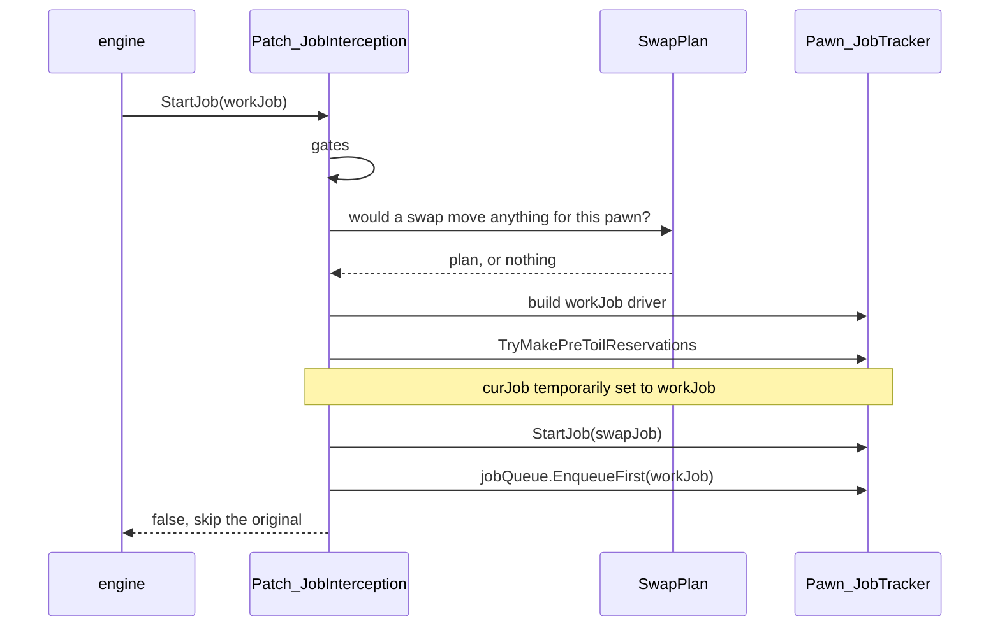
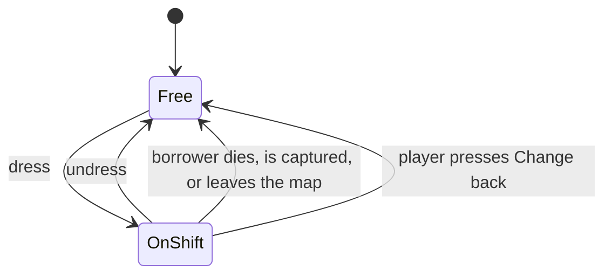

# Design

What this mod interfaces with inside RimWorld, and why each interface took the
shape it did. For build and debug, see [DEVELOPMENT.md](DEVELOPMENT.md).

Engine claims were checked against the decompiled game assembly, version
**1.6.4871**. References like `Pawn_JobTracker.cs:338` point into that
decompilation. Line numbers drift across game versions; method names drift much
more slowly.

No RimWorld modding experience assumed. The primer below covers everything the
rest of the document uses.

## What it does

A vanilla outfit stand placed in a work room dresses colonists for that room's
work. When a colonist takes an **automatic** job whose work type matches the
stand's and whose target is in the stand's room, they change into the stand's
outfit, do the work, and change back when their next job takes them elsewhere.

The mod ships no art and no apparel. It adds behaviour to an existing vanilla
building.

## Constraints

| Constraint | Consequence |
|---|---|
| Automatic work only | A player-forced job is a direct order. Sending the pawn to a wardrobe first makes orders feel broken. Applies in both directions. |
| The room is the boundary | Ties the uniform to where the work is, so a pawn is never far from their civvies in a crisis. An unbounded "always wear X for work Y" mode reintroduces that distance and was rejected. |
| Zero new art | Ownership is patched onto the vanilla def rather than shipped as a new building. Icons come from vanilla's UI atlas. |
| Fail open | This patches the method that starts every job for every pawn. An unhandled exception there is a bricked colony. Every hook catches, logs once, disables the mod for the session, and lets vanilla proceed. |

## RimWorld in five concepts

1. **Defs and XML patches.** Game content is XML (`ThingDef`, `JobDef`,
   `WorkGiverDef`), loaded into a global database at startup. A mod adds its own
   defs or patches others', vanilla included. Shift Change adds one `JobDef` and
   patches two components onto the outfit stand.
2. **Comps.** A `ThingComp` attaches to a thing via its def. Composition, not
   inheritance. Comps tick, save state, contribute gizmos and inspect text.
   Attaching one by XML patch gives a vanilla building modded behaviour without
   replacing its class.
3. **The job system.** Pawns decide what to do via a **think tree**. For work it
   walks the pawn's priorities and asks each **WorkGiver** to scan for something
   to do. A WorkGiver produces a **Job**, which `Pawn_JobTracker.StartJob` turns
   into a running **JobDriver**, a state machine of toils. Starting a job
   **reserves** its targets.
4. **Harmony.** The runtime patching library. Prefixes, postfixes, transpilers.
   A prefix returning `false` skips the original method.
5. **Scribing.** The save system. Objects write fields via `Scribe_*.Look`.
   Unrecognized fields are silently skipped on load, which is what makes
   "remove the mod, keep the save" work.

## Interception

A Harmony prefix on `Pawn_JobTracker.StartJob`.

The decision needs three facts: the job's **work type**, whether it was
**player-forced**, and its **target location**. All three are readable at
`StartJob` — the assigning code has already attached the `WorkGiverDef` (whose
`workType` field is the work type), the `playerForced` flag and the targets.

### Why not TryOpportunisticJob

The nearest prior-art mod hooked `Pawn_JobTracker.TryOpportunisticJob`, the slot
vanilla uses to insert "haul something on your way" jobs. It is called from
inside `StartJob` for every job (`Pawn_JobTracker.cs:338`) and its contract is
"return a job to do first". It is unusable twice over:

- Vanilla bails out for drafted pawns and several other states
  (`CanPawnTakeOpportunisticJob`, `Pawn_JobTracker.cs:626-649`).
- It fires only if the incoming job's def sets `allowOpportunisticPrefix`
  (`:657`). 164 of 321 JobDefs do, and `TendPatient` is not among them
  (`Jobs_Work.xml:370-375`). Doctoring is unreachable through that hook.

The prior-art mod's source contains a commented-out line forcing the flag.

### Inserting a job ahead of another

The pattern is vanilla's own. When vanilla inserts an opportunistic haul it
starts the other job and puts the displaced job at the front of the pawn's queue
(`Pawn_JobTracker.cs:331-347`).

Two details matter:

- **Start the swap first, enqueue second.** If starting the swap throws and the
  original were already queued, the fail-open catch would let the original also
  start, putting one Job object in two places. `StartJob` never reads the queue,
  so enqueueing after is equivalent on success and safer on failure.
- **Re-entrancy.** Starting a job from inside a `StartJob` prefix re-enters the
  prefix. A static guard makes the inner call pass through.

### Deferred jobs carry their reservations

Vanilla reserves a job's targets inside `StartJob`, and the prefix skips the
original. Without more, the deferred job's targets sit unreserved for the whole
walk-and-change and another pawn's work scan can take them. In play this looked
like a distant doctor dressing for a patient a nearer doctor had already tended,
then changing straight back.

Vanilla's opportunistic path reserves first, then enqueues, and does not release
(`Pawn_JobTracker.cs:331-347`). Shift Change does the same: build the deferred
job's driver, call `TryMakePreToilReservations`, then start the swap. Safe to
copy because vanilla's queue plumbing releases a queued job's reservations on
every clearing path (`QueuedJob.Cleanup` → `ClearReservationsForJob`,
`QueuedJob.cs:24-33`), and a queued job re-reserving its own targets is
idempotent.

The dry run has to happen with `curJob` temporarily set to the deferred job.
Vanilla assigns `curJob` before calling `TryMakePreToilReservations`, and drivers
rely on it: `JobDriver_SocialRelax` reserves its seat against `pawn.CurJob`, not
its own job field (`JobDriver_SocialRelax.cs:30`). With `curJob` unset the
reserve sees a null job, fails with a "without a valid job" warning
(`ReservationManager.cs:306-309`), and the divert silently degrades into
ride-along. In play, a crafter drank at a bar in uniform.

### The gates

The prefix declines to act when:

| Gate | Why |
|---|---|
| drafted, downed, or in a mental state | being told where to be, or not themselves |
| map danger ≠ None | **dressing only** — see below. No vanilla precedent to copy: `JobGiver_OptimizeApparel` has no danger check; vanilla gets apparel-change safety from think-tree position (`Humanlike.xml:302-306`), and this hook sits downstream of the think tree |
| `job.playerForced` | direct orders execute immediately, in both directions. A pawn in uniform given a forced order keeps it on and returns it later |
| `workGiverDef.emergency` | emergency givers exist because something cannot wait (`DoctorTendEmergency`). A bleeding pawn must not wait for a wardrobe trip |

The forced and emergency exemptions originally gated only the dressing path.
Play showed the return trip could delay an emergency identically, so both were
hoisted above each direction.

The danger gate went the other way, and for the same reason: read the
directions separately. It sat above both arms, which made a raid a freeze
rather than a pause — every borrower stayed in costume for its duration, and
since nothing fires on the way back to `None`, anyone whose next job was a long
one wore it well past the all-clear. Found in play: four colonists spent a raid
in evening dress with their flak vests and helmets parked in a full-change
recreation stand, and the gate meant to protect them was the reason they could
not go and get them. It now sits **below the return trip and above both dress
arms**, so it means "no changing in" rather than "no changing". Changing in is
a detour nobody should take mid-firefight; changing back is a pawn moving
toward their own gear. Nothing reacts to danger *starting* — a raid never yanks
anyone to a wardrobe. `TryDressMidJob` keeps its own copy of the check
unchanged, being a dress path already.

### Meal breaks

An ingest job's `targetA` is the food, and the chew spot is chosen mid-job
(`Toils_Ingest.CarryIngestibleToChewSpot`), so the return trip's room test cannot
see where eating will happen. A cook grabbing a meal stored in the kitchen walked
to the dining room in whites.

Ingest-family jobs are therefore identified by driver class and bypass the room
test: food already on the pawn means no divert, eat as-is; anything else means
change out first, wherever the food is stored.

## Building_OutfitStand

Used as-is, with two comps patched onto its def and its container API called from
the swap driver.

The def is patched as a **commons**: the `<comps>` node is ensured
first and appended into second, because other mods add comps to this same def —
Outfit Stands Plus does — and a def left with two `<comps>` nodes is resolved
last-wins with a red "defines the same field twice" error, deleting whichever
mod's node came first. For the same reason our assignable comp scribes
mod-prefixed keys (comps scribe flat into the thing's save node, so two
`CompAssignableToPawn` subclasses writing vanilla's generic `assignedPawns`
cross-read on load), and every lookup of our assignable comp is exact-type first
(`TryGetComp<CompAssignableToPawn_ShiftStand>`) with a base-typed fallback — comp
order, which follows patch order, decides nothing.

| Vanilla provides | Detail |
|---|---|
| Apparel storage with filters | storage-group support, contents displayed on the stand model |
| `allowRemovingItems`, default false | one flag driving both `IHaulSource.HaulSourceEnabled` and `IApparelSource.ApparelSourceEnabled` (`:102-104`). This default is what stops haulers carting uniforms to stockpiles and stops `JobGiver_OptimizeApparel` raiding the stand. It does not reach traders — see [Withholding from trade](#withholding-from-trade) |
| One outfit of capacity, structurally | `HasRoomForApparelOfDef` (`:332-342`) is not a count limit but a conflict check, refusing anything that cannot be worn together with what is already there |
| Eviction | `TryDropThingsToMakeRoomForThingOfDef` (`:344-364`) drops conflicting contents on the floor nearby |

The capacity fact is load-bearing. A stand is one outfit's worth, full stop,
which killed the "shared stand holding several pawns' sets" design at the root:
not untidy, physically impossible. Ownership follows from capacity.

Eviction is the entire "dead owner's clothes" story. Abandon the ledger, leave
the garments as ordinary contents, and the next user's first deposit evicts them
for haulers to collect. No custom reclaim logic exists because none is needed.

What vanilla does not provide:

- **Any concept of whose clothes are inside.** The stand scribes its container,
  settings and the toggle, nothing else (`:878-885`). It is a shared bag.
- **A usable swap.** `JobDriver_UseOutfitStand` is anonymous: it claims every
  wearable item for whoever arrives (`:38-63`) and pushes their displaced clothes
  back into the same undifferentiated bag (`:83-96`). Two pawns sharing one stand
  walk off in each other's clothes. It also force-flags everything it hands out
  (`:91`), including street clothes on the way back, whether or not they were
  force-worn before. Both properties made it unusable as a return trip.

## Ownership and the ledger

`CompAssignableToPawn` is the ownership machinery beds and thrones use, and it is
XML-attachable: the "Set owner" gizmo, the assignment dialog, reference scribing
and stale-owner cleanup all come with it (`CompAssignableToPawn.cs:164-195`). The
subclass narrows candidates to pawns capable of the stand's work types and
renames the gizmo. The base comp never displays the owner anywhere; beds only
appear to because `Building_Bed` writes it into its own inspect string.

Patching onto the vanilla def means existing stands in existing saves gain the
gizmo on load. The cost is discipline about touching a shared building.

> **Hotkey collision.** The base comp hardcodes its gizmo to `Misc4`
> (`CompAssignableToPawn.cs:176`), which is **N**. Harmless on beds. The outfit
> stand is a *storage* building, and the settings clipboard binds copy to the same
> `Misc4`/N (`StorageSettingsClipboard.cs:40`). Reusing a vanilla comp on a
> building category it never shipped on can import a hotkey collision. The
> subclass strips the binding.

**Unassigned means pooled.** Any capable colonist may claim a free stand, the bed
model, and the answer to "a kitchen has eight possible cooks": you need one stand
per *concurrent* cook. An assigned stand is reserved for its owner. A mod setting
(default on) turns pooling off globally.

**The borrower, not the owner, is the ledger's truth.** The comp records, scribed
by reference: the borrower, the garments they parked, the garments they took, and
which parked garments were force-worn at check-in. Rebuilding the return trip
from the assigned owner would be wrong the moment a stand is reassigned
mid-shift.

`Free` means the ledger is empty and the stand is claimable. `OnShift` means it
holds a borrower, the parked civvies, the taken uniform, and the forced-flag
snapshot.

**Ownership must end when vanilla thinks it ends.** `Pawn_Ownership.UnclaimAll()`
is called on death, trade, kidnap and map exit (`Pawn.cs:2341, :2565, :2599,
:2645`) and unclaims a hardcoded list: bed, grave, throne, deathrest casket
(`Pawn_Ownership.cs:286-292`). It does not walk `CompAssignableToPawn` buildings,
so a postfix extends the same moment to stands. The same postfix reaps *borrowed*
stands, which unassignment alone would miss entirely, because a pool borrower was
never assigned to anything.

**Banishment is not on that list, and does not join it later.** On a spawned
colonist `PawnBanishUtility.Banish` clears guest status and runs
`pawn.SetFaction(null)` (`:53-56, :66-69`), reaching no unclaim. Nor does the
map-exit route rescue it afterwards: `Pawn.ExitMap` gates its `UnclaimAll` on a
flag (`Pawn.cs:2552, :2565`) that the guest-status clear has already made false.
So the pawn walks away alive, still holding the uniform, with the ledger intact
behind them. `Patch_BanishStands` calls the same reaper at the moment of
banishment.

It is deliberately eager rather than a liveness test at the read points, and the
distinction is not cosmetic. A stand that merely *disbelieves* a ledger naming a
departed pawn believes it again the moment that pawn is recruited back — the
ledger was never emptied. The harness asserts exactly this
(`still reaped after re-recruitment`), because the first version of the fix
passed every other assertion and had that hole in it.

## Wearability: one authority

"What would this swap move for this pawn?" is asked twice: by the stand selector
(is this trip worth taking?) and by the driver on arrival (what do I move?).

These were once two implementations and they diverged. The selector asked "does
the stand hold apparel?", the driver asked whether *this pawn* could wear it. A
stand holding a garment the pawn could not wear was selected, walked to, and
swapped with, moving nothing — indistinguishable from a pawn changing at an empty
rack.

`SwapPlan` builds the plan for both callers, so the selector asks precisely the
question the driver will answer. `ApparelUtility.CanWearTogether`, `PawnCanWear`,
biocoding checks and `Pawn_ApparelTracker.IsLocked` are wrapped there and nowhere
else.

## The forced-apparel lifecycle

The forced flag (`SetForced`) is what exempts apparel from
`JobGiver_OptimizeApparel`. Without it the optimizer un-swaps the uniform at its
next tick. So the swap forces what it issues and — the half vanilla's own driver
never does — **clears the flag on the return trip**, or the uniform is pinned to
the pawn forever.

The subtle part: **every apparel removal destroys the flag.**
`Pawn_ApparelTracker.Notify_ApparelRemoved` calls `SetForced(ap, false)`
unconditionally (`Pawn_ApparelTracker.cs:784-790`). The moment a force-worn duster
is parked in the stand, the fact that it was force-worn ceases to exist anywhere
in the game.

The ledger records forced-ness at check-in, the last moment the fact exists, and
the return trip restores it exactly. Ordering is not optional:

1. Capture the forced flags **before** `Remove`.
2. Restore them **after** `Wear`.
3. Read the ledger before `NotifyUndressed` clears it.

Garments that were forced come back forced; garments that were not stay
policy-managed. Vanilla's driver instead force-wears everything it hands back,
which is the opposite error.

A deliberate non-feature: royal titles and ideology roles can *require* apparel,
and nothing in vanilla stops a swap removing a required garment. The optimizer
only scores requirements (×25 and ×10, `JobGiver_OptimizeApparel.cs:360-398`) and
the stand driver checks only the narrower `IsLocked`. This mod does not block it
either. The only available lever is refusing the uniform, so a titled pawn would
silently never change, which is worse than a mood penalty the player already sees
in the needs tab. Assigning the stand was a deliberate act.

## Pausing the wardrobe optimizer

While a pawn is checked out, `JobGiver_OptimizeApparel.TryGiveJob` is prefixed off
entirely.

Found in play: Ideology's apparel-recolor branch rides that giver
(`JobGiver_OptimizeApparel.cs:84`) and fires whenever any *worn* item has a
`DesiredColor`. On shift that is the uniform, so a pawn walked off and permanently
dyed staged kit its favourite colour. The styling station's float-menu order
bypasses the giver and stays available, because direct orders are never blocked.
`nextApparelOptimizeTick` is untouched, so civvies optimize normally after
changing out.

A second guard covers reloads: scribed or queued `RecolorApparel` jobs from
pre-pause sessions resume after load and the driver dyes whatever its queue names,
wherever it sits. Its `TryMakePreToilReservations` is failed — the vanilla-routine
way to cancel — when the pawn is on shift or any queued garment is parked in a
stand.

## Withholding from trade

Vanilla lists a stand's contents to traders by two routes, and neither is gated
by anything a player would recognise as a lock.

| Trader | Route |
|---|---|
| Orbital ship | `TradeUtility.AllLaunchableThingsForTrade` special-cases `Building_OutfitStand` and yields its `HeldItems` (`TradeUtility.cs:123`) |
| Visiting caravan | `Pawn_TraderTracker.ColonyThingsWillingToBuy` walks `AllColonistBuildingsOfType<IHaulSource>()` and yields everything each one directly holds (`Pawn_TraderTracker.cs:123-134`) |

`TradeDeal.InSellablePosition` then whitelists `ParentHolder is
Building_OutfitStand`, so the unspawned held items sail through the position
check (`TradeDeal.cs:85`). What ends up on the trader's list is the uniform in
active rotation and, if anyone is on shift, their own clothes parked beside it.

**`allowRemovingItems` is not in this story at all**, which is worth saying out
loud, because the section above spends a page on that flag. The caravan lister
keys on **type**: a stand whose `HaulSourceEnabled` is false is enumerated
anyway, and `Patch_AllowRemovingToggle`'s enforcement — which does hold the
optimizer off — buys nothing here. A player who read the removal toggle's
tooltip, saw "the stand's contents are exposed", turned it off and concluded
the stand was shut would be wrong.

**One postfix on `TradeUtility.PlayerSellableNow` covers both routes.**
`TradeDeal.AddAllTradeables` re-tests every candidate through it and drops the
item on false (`TradeDeal.cs:46-50`) before it can become a `Tradeable` — not
greyed out, absent. Patching the choke rather than the two collectors also picks
up gift mode, which shares the deal. Every caller of that method in the engine
is trade-side, so nothing outside a trade window notices; the def-level
`EverPlayerSellable` that `StatWorker` and `Dialog_SellableItems` use is a
different method and is untouched.

Deliberately narrow: it withholds the kit from traders and does nothing else.
Caravan packing, hauling, raider theft and the optimizer all run through other
code, and a player who wants to sell a uniform unticks the box.

**On by default, and old saves adopt it.** The exposure is invisible from the
inspect pane, so a player cannot audit it by eye and will not go looking for a
switch they do not know they need — the same reasoning that made the removal
flag self-enforcing rather than merely documented. `Scribe_Values` writes
nothing when a value matches its default and hands the default back when the
node is absent (`Scribe_Values.cs:70-78,88`), so a save predating the flag loads
protected, and the only thing ever written is a deliberate opt-out.

Keyed on the **declaration**, like the removal-flag disable. `BlocksTrade` is
`!excluded && withholdFromTrade`, so a stand set to "Not used for shift changes"
is tradeable whatever the flag says — and the dialog's `ModeOnly` return already
hides the row for exactly those stands. One condition, not two that can drift
apart.

The failure mode is vanilla. A postfix on a public static that does nothing
unless it finds our comp: if Ludeon moves the method, the patch fails to apply,
Harmony logs it, and stands go back to being tradeable, which is where they
started.

## Change back

A postfix on `Pawn.GetGizmos` puts a **Change back** command on any colonist
currently in a stand's uniform. It cancels queued orders and issues the swap
through vanilla's `TryTakeOrderedJob`, so it behaves like any right-click order
and a tend still finishes first.

It exists because the automatic return trip is a **pull, not a push**: it fires
at a job boundary, when the pawn's own next job takes them out of the room. A
pawn who wants out of whites *now* may not reach a boundary for hours, since
sleep is the longest job in the game, and without this their only way back is
the player hunting for the stand the ledger already knows.

The danger gate no longer suppresses that return trip, and this section used to
say it did. The gate is one-directional: it stops a pawn changing *into* a
uniform while the map is under threat, and leaves changing *back* alone. It
once gated both, which froze every borrower in costume for the duration of a
raid and well past it, and on a full-change stand that meant their armour sat
in the wardrobe they were not allowed to walk to.

A press sets a **room-exit latch**: that pawn will not dress again *in that room*
until they have left it. Positional rather than a countdown, because it is the
changing that must not cycle, not the work. They keep working in the room in
civvies, and a job in a different room dresses them normally, since that is a
different uniform and they are leaving anyway. Both dress paths honour the latch,
including the mid-job catch-up, or a stand returning to the pool would re-dress
the pawn the player just pulled out.

The latch stores the **stand**, not the `Room`, so both sides are re-derived live
and a rebuilt wall cannot strand a stale reference. It is keyed by pawn reference,
so a stale entry is inert rather than wrong. Drafting drops it outright, so
raid → change back → draft → fight → undraft leaves no residue.

Nothing here is automatic. No auto-change on raid, and drafting a pawn in uniform
is left alone, because that is a legitimate player choice.

## Rooms to work types

Vanilla continuously scores every room: each `RoomRoleDef` has a worker that rates
the room's contents, highest score wins. Read, never patched.

Two quirks matter:

- **Hospital is a trump card, not a contestant.** Its worker returns a flat
  100,000 for any non-prisoner *medical* bed and 0 otherwise
  (`RoomRoleWorker_Hospital.cs:8-32`); Laboratory scores 60 per lab bench
  (`RoomRoleWorker_Laboratory.cs:8-21`). A hospital full of genetics equipment is
  still a Hospital. A ward whose beds are not flagged medical scores zero, and one
  gene bank flips it to Laboratory.
- **Roles are one per room; work is not.** A Workshop hosts crafting, tailoring,
  smithing and art. A Laboratory hosts research *and* drug synthesis, which
  arrives as **Crafting** work (`DoBillsProduceDrugs`, `WorkGivers.xml:1139-1148`).

So a role maps to a **set** of work types, not a scalar. The first design used
scalars and missed the drug lab entirely.

| Role | Work types |
|---|---|
| Hospital | Doctor |
| Laboratory | Research, Crafting |
| Kitchen | Cooking |
| Workshop | Crafting, Tailoring, Smithing, Art |
| Barn | Handling, Doctor |

Base-wide pass-through work is deliberately excluded: Hauling, Cleaning,
Construction, Firefighting. A hauler carrying meals into the hospital should not
scrub in.

A per-stand dialog overrides the set, with three canonical states: automatic
(follows the room), custom set, excluded. A decorative stand in a work room can be
excluded so it never joins the pool.

The trigger is the **job**, not the doorway: work-type-in-set AND
job-target-in-room. A doctor crossing the hospital to reach the storeroom, or
anyone walking in to eat, changes nothing.

## The recreation branch

Work jobs name their purpose through `workGiverDef.workType`; recreation jobs
name theirs differently. Every joy job a driver ticks carries a
`JobDef.joyKind` — `JoyGiverDef` raises a config error when a giver and its
jobDef disagree, and `JoyUtility.JoyTickCheckEnd` warns if a joyKind-less job
ever ticks joy — so the interception's second arm keys on exactly that: a job
carrying a joyKind, headed for a room whose stand has the recreation trigger
on, diverts through the stand like any work shift. Everything downstream is
the work arm's, untouched — reservation carry, ledger, optimizer pause,
change-back latch, return trip — because none of it ever knew what a
WorkTypeDef was.

Two joy classes stay deliberately outside the arm. Consumption (beer, drugs,
chocolate) rides `JobDefOf.Ingest`, which carries no joyKind at all — its joy
lives on the ingestible and lands in `Thing.Ingested` — and its consumption
spot is chosen mid-job, the same fact behind the eating policy in the return
trip. It is undetectable and unplaceable at StartJob, and the branch does not
pretend otherwise. Reading carries a joyKind but picks its spot mid-job too
(`CarryToReadingSpot`), so it is excluded by driver class: at StartJob its
target is the book, wherever that is shelved, and dressing for the shelf's
room would be the packed-lunch misread with a cover on.

The recreation arm reads the room targetB-first (`JoyTargetCell`): for the
sit-and-play classes B is where the pawn actually sits while the joy ticks —
the chair at the chess table, the watch cell in front of the television —
while A is the venue building; where B is unset (swimming's water cell, a
gather spot, art, a grave) A is already the venue. One vanilla job is BOTH
work and joy-class — VisitSickPawn, Doctor work whose JobDef carries joyKind
Social — and it deliberately resolves B-first (the visitor's chair) at every
site, because the arms may differ but the answer to "where does this job
happen" must not. The RETURN trip reads joy
jobs with the same resolver — one definition of "where does this job happen"
per job class, consumed by both directions — because split reads livelock: a
vanilla SocialRelax can seat its chair across a held-open door from its
gather spot (the chair search is line-of-sight only, no same-room check),
and A-first-out, B-first-in turned that one job into an endless
dress/undress ping-pong. The work arm keeps its A-first read: work jobs put
the pawn at A.

Outdoor joy is fenced off explicitly, not by accident. Every outdoor cell
resolves a real Room — the one map-spanning, edge-touching outdoor room, not
null — so without a guard, a rec-toggled stand in open ground would serve
every walk, skygaze and snowman on the entire map. The arm (and the mid-job
catch-up's joy twin) refuses rooms that touch the map edge. A walled but
roofless yard is its own non-edge room and stays eligible on purpose;
open-ground service belongs to a future mode that supplies its own
boundary — a player-drawn zone, or a radius around the stand — done
deliberately or not at all. The guard is the interim, not the verdict. Two more deliberate refusals: a pawn lying in
bed is never diverted — vanilla issues in-bed joy precisely so patients stay
put — and a rec shift's drink from the SAME room does not trigger the
sit-down-break undress: a rec room stocks its own drinks, and the meal
policy is a work-room rule.

The trigger is one bit, not a joy-kind picker, because the room is the
selector: a robe stand dresses for the sauna by standing in it. The ten
JoyKindDefs cut across venues — Meditative alone spans prayer, snowmen,
swimming and modded hot-spring bathing — so a kind picker would offer
players categories their rooms do not have. Automatic stands light up in
rooms whose role implies recreation (vanilla RecRoom, plus known third-party
pool roles, silent-fail as ever); pure pool rooms are roleless — swimming is
terrain-driven, so the rec-room worker counts nothing in them — and take the
manual toggle. Recreation and work types are mutually exclusive on a stand:
it holds one outfit, and one outfit serves one purpose, so ticking
recreation clears the work set and the dialog hides the work grid outright
(an interactable-looking list that silently unticks recreation would be a
trap), while ticking any work type drops recreation. Exclusivity also makes
the dual-purpose stand — the one configuration where the same-room meal
exemption could touch a work shift — unreachable from the UI by
construction. A stand with neither half selected is the excluded state
under another name, so the canonical states survive intact.

## The mid-job catch-up

With two workstations and two stands, a pawn can start working bare because both
stands were checked out at the moment their job started, then a stand frees up
seconds later.

When a stand returns to the pool, scan for a colonist already doing matching work
in its room and interrupt them to change, resuming their job afterwards. The
interrupt is the same mechanism vomiting uses: `StartJob` with
`resumeCurJobAfterwards` suspends the current job when its def allows and resumes
it from the queue (`Pawn_JobTracker.cs:293-296`).

The eligibility gate is `suspendable && casualInterruptible`. Both default true
(`JobDef.cs:24-26`) and both are **false on `TendPatient`**, so bills and research
are caught up while a doctor mid-treatment is never pulled off a patient. Crafting
progress lives in the unfinished thing on the bench, so nothing is lost. The gate
was not designed; it fell out of reading what vanilla declares about its own jobs.

## State across save, load and uninstall

- **The ledger scribes by reference** inside the stand's own save node. Vanilla's
  stand driver does the same for its transfer lists.
- **Session-scoped statics reset when the loaded game changes.** Two registries
  live outside the save: the borrower-to-stand map, and a retry cooldown keyed by
  `thingIDNumber` and stamped with `TicksGame`. Both counters restart per save, so
  loading an earlier save in the same session leaves a stale cooldown sitting in
  the future, silently blocking a same-ID pawn until the clock catches up. A guard
  clears both whenever `Current.Game` changes identity.

  Deliberately not a `GameComponent`: a component writes its class name into every
  save, costing players a one-time load error after uninstalling. The guard has
  zero save footprint.
- **One scribed flag defaults to `true`.** `withholdFromTrade` is the only comp
  field whose default is not the zero value, and that is what carries the trade
  protection into saves that predate it: an absent node means on. The cost is
  the mirror image — an opt-out is the only state that gets written, so a stand
  deliberately left tradeable is the one relying on its node to survive.
- **Uninstalling is clean by construction.** Saved state is comp fields inside
  vanilla buildings' nodes, skipped silently when unrecognized, plus vanilla's own
  forced-apparel flags. Removing the mod reverts every stand to plain vanilla
  furniture. A pawn mid-shift keeps wearing the uniform, which can be unforced by
  hand, and their own clothes are sitting in the stand.

## Development tooling

Three kinds, and only one of them stays behind.

**The hot-reload rig never ships.** Zetrith's EditCompileReload supports UI
iteration in Debug; Release compiles none of it and sweeps its artifacts from
the mod's load path. It constrains the source in ways that look arbitrary from
the code alone — no `private` members, no auto-properties, no protected base
members — because a hot-swapped method body executes cross-assembly. Build,
debug and the full rules are in [DEVELOPMENT.md](DEVELOPMENT.md).

**The scene builders never ship either**, and this reverses what this section
used to say. Through v1.0.0 the demo stage, the preview stage and the lifecycle
harness were all compiled into Release, on the argument that "the cost is a
handful of entries in a menu no player opens." That was wrong twice over. The
debug actions menu is a surface players genuinely use for fine control over
finished mods — and these are not harmless entries. Each stage builder is a
`ToolMap` action with no confirmation that `GenDebug.ClearArea`s a 200–320 cell
footprint, destroying every building and item in it and vanishing any pawn
standing there — gear and all, no corpse, no letter — and then leaves permanent
player-faction colonists, owned buildings and rewritten terrain behind. The
harness clears its 7×7 pad once for every staged case, every run.

The two real arguments in the old rationale both survive, and neither ever
required *menu presence*:

- *Footage is filmed on live builds.* That binds the build **configuration**,
  not the shipped dll. The `Media` config films identical product behaviour
  with the fixtures riding along.
- *The harness must run against exactly the assembly that ships.* That binds
  the harness **code**, not its menu entry. `-shiftchange-harness`
  (`Patch_HarnessAutoRun`) is the release gate and never touches the menu, and
  `run-harness.sh` builds plain Release itself — so the gate still asserts
  against the literal dll players install.

**So the harness body ships and its menu entry does not.** `SCENES` (defined on
Debug and Media, never Release) carries the stage files and the harness's
`[DebugAction]`; the shared fixture primitives live in `DebugTools_Fixtures`,
which always compiles because the harness builds its fixtures from them. A
shipped build registers no debug actions at all, so the "Shift Change" category
never renders. `devtools/check-shipped-dll.py` asserts both directions in CI —
stages absent, gate present.

**The five `[TweakValue]` fields do still ship**, and that is not an
inconsistency. The bar here is destructiveness, not reachability: a TweakValue
moves a number and resets at the next launch, and they are how a player gets
walked through a report — turn `Enabled` off to see whether this mod is
involved, turn `Verbose` on to get a log saying why a stand did nothing.

What the harness covers, and the rather larger list of what it does not, is in
[TESTING.md](TESTING.md).
