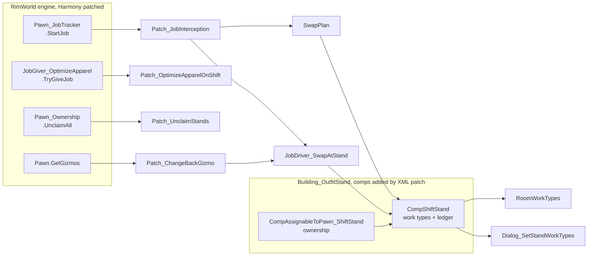

# Development

Build, debug and test loop. For why the mod is shaped the way it is, see
[DESIGN.md](DESIGN.md).

## Requirements

| | |
|---|---|
| .NET SDK | 8.0 or later. The project targets `net472`; `Microsoft.NETFramework.ReferenceAssemblies` supplies the targeting pack, so no Framework install is needed on macOS or Linux. |
| RimWorld | 1.6, with the Odyssey expansion. Optional for building, required for running and for engine navigation. |
| Harmony | The `brrainz.harmony` mod, at runtime only. Not vendored. |

## Build

```bash
dotnet build Source/ShiftChange/ShiftChange.csproj -c Release
```

Output goes straight to `Assemblies/`, which must contain exactly one file.
Release runs a `CleanDevArtifacts` target that deletes anything else it finds
there, including hot-reload leftovers.

## Install

Symlink the repository into the game's `Mods/` directory, then enable it in the
in-game mod list along with Harmony. Enable **Development mode** in Options to
get the debug log and god tools.

Def changes require a full game restart. Do not use vanilla's `Hot reload Defs`
or the community equivalent; both corrupt live state on a large mod list. C#
changes are a different story, see [Hot reload](#hot-reload) below.

## Engine navigation

RimWorld publishes no API documentation, so go-to-definition into the engine is
the reference. `F12` on any engine type decompiles it in place.

Two things have to line up:

1. The editor is allowed to decompile. In VS Code that is one setting, and
   `.vscode/` is gitignored, so add it yourself:

   ```json
   { "dotnet.navigation.navigateToDecompiledSources": true }
   ```

2. The build references assemblies that actually contain IL.

| References | Source | `F12` shows |
|---|---|---|
| `Assembly-CSharp.dll` from a local install | game folder | real decompiled bodies |
| `Krafs.Rimworld.Ref` | NuGet | signatures only, empty stubs |

The project picks between them on **install presence, not build configuration**:
if a RimWorld install is found, every configuration uses the real DLLs; if not,
it falls back to Krafs.

Overrides:

| Goal | Flag |
|---|---|
| Non-standard install location | `RimWorldManaged=/path/to/Managed` (env var or `-p:`) |
| Reproduce the CI build exactly | `-p:DisableLocalGameRefs=true` |

CI has no game install, so it always compiles against Krafs, and the release job
rebuilds before packaging. The dll players receive is always the Krafs-built
one regardless of how it was built locally.

## Hot reload

Debug builds compile in Zetrith's EditCompileReload: a rebuild swaps changed
method bodies into the running game. Release references none of it.

```bash
dotnet build Source/ShiftChange/ShiftChange.csproj -c Debug
```

`[ShiftChange] hot reload applied` in the dev log is the heartbeat. ECR's own
messages are prefixed `[ShiftChange/ECR]`.

**UI and layout only.** Behaviour (jobs, ledger, scribing) is verified on a
clean Release restart, never in a swapped session.

| | Live | Lab |
|---|---|---|
| Build | Release | Debug |
| On-screen badge | none | cyan, turns orange at first reload |
| Gameplay interception | full | full until first reload, then disabled |
| Saving | freely | never after a reload |

A Debug build behaves identically to Release until the first reload. The first
reload forks the session into a lab: gameplay interception disables itself and
the save is no longer trustworthy. Open a disposable save before iterating.

Rules that are not obvious:

- **Never build Release during a hot session.** The sweep deletes the
  `.dll_orig` the watcher polls, killing reload until relaunch.
- **Structural edits need a restart**: instance fields, constructors, attribute
  changes, virtuals. New types and static fields do swap.
- A session is capped at 64 reloads. The 65th needs a restart.

### Language rules the rig imposes

ECR loads each reload as a new assembly and redirects methods into it, so every
member access from a swapped body is cross-assembly. Unity's Mono does not
implement `IgnoresAccessChecksTo`, so the only mechanism that works is
`InternalsVisibleTo`, granted to the numbered twins in `HotReloadVisibility.cs`.

| Rule | Failure if broken |
|---|---|
| `internal`, never `private` | `FieldAccessException` at the first swapped access |
| No auto-properties | backing field is always private, no syntax widens it |
| No protected base members | `MethodAccessException`; mirror the value as an internal const instead |

Within a single-assembly mod, `internal` and `private` are equivalent in
practice, so this costs nothing. CI enforces the first two.

## Runtime knobs

Dev mode → **Tweak values** → `ShiftChange`. These are `static`, not `const`,
specifically so they are tunable in play.

| Field | Default | Effect |
|---|---|---|
| `Enabled` | `true` | Master switch for all interception |
| `Verbose` | `false` | Log every decision, not just swaps. Noisy. |
| `DressMidJob` | `true` | Mid-job catch-up when a stand frees up |
| `RetryCooldownTicks` | `600` | Minimum ticks before reconsidering a pawn whose swap could not start |

Mod settings carry one player-facing toggle, `poolUnassignedStands` (default
on). Settings live in vanilla's config file, so uninstalling leaves no trace in
a save.

Dev mode → **Shift Change** → **Build demo stage**, then click a cell: three
roofed rooms (hospital, laboratory, kitchen) with stocked stands, a
self-starting kitchen bill and two workers. This ships in Release deliberately.

## Testing

Behaviour is verified in game, on a clean Release restart. Two tools help.

**The demo stage** is the general fixture — a colony in one click, where a swap
can be watched end to end.

**The lifecycle harness** covers what the demo stage cannot: dev mode → **Shift
Change** → **Run lifecycle harness**, then click a clear 7×7 area. It builds a
throwaway stand-and-borrower, fires one real engine lifecycle event at it,
checks where the ledger landed, tears the fixture down, and repeats. Results go
to the dev log with a toast tally.

It exists because some situations are prohibitively expensive to arrange by
hand. A gravship launch needs substructure, fuel, thrusters and a pilot console
before the game will let one leave the ground, and the moment worth observing
lasts one tick. That cost is why the gravship path shipped reasoned-about
rather than tested — and it was wrong.

Each case splits in two, and only one half is testable here:

| Half | Example | Settled by |
|---|---|---|
| Engine | "a launch despawns aboard-things with `WillReplace`" | reading `GravshipUtility.cs:389` — playing it does not make it truer |
| Ours | "given that call, our ledger survives" | the harness |

**The rule that keeps it honest: every case calls the engine's own entry
points** — `Thing.DeSpawn`, `GenSpawn.Spawn`, `Pawn.Kill`,
`PawnBanishUtility.Banish` — never our `PostDeSpawn` directly. The engine's comp
dispatch and ordering then run for real, and only the orchestration around them
is simulated. A harness that hand-rolls the call sequence tests the author's
model of the engine and certifies whatever that model got wrong.

One limit worth stating: fixture setup calls `NotifyDressed` directly rather
than running the job driver, so a pass says nothing about whether the DRIVER
builds a correct ledger. That stays a play observation.

A case can also be marked `GAP` — a known failure with its reason recorded,
counted apart from `Failed` so a green run stays meaningful, and reported as
`FIXED` if it ever starts passing. There are none today. Banishment was the
last one, and closing it is the clearest thing the harness has done: the fix
that made the obvious four assertions pass was still wrong, because it only
made the stand *disbelieve* a ledger it had never emptied. Recruit the wanderer
back and the stand died a second time. The `still reaped after re-recruitment`
assertion exists to hold that door shut.

### Running it

```bash
devtools/run-harness.sh              # minimal mod list — the iteration loop
devtools/run-harness.sh --full       # your real mod list — the release gate
devtools/run-harness.sh --alongside  # second instance beside a live game
```

One command, no hands. It builds Release, launches with `-quicktest
-shiftchange-harness`, waits for the game to run every case and quit itself,
prints the report, and exits non-zero if anything failed — so it can gate
something.

**It runs isolated.** `-savedatafolder=dist/testdata` gives the test instance
its own `Config/ModsConfig.xml`, `Saves/` and prefs (`GenFilePaths.cs:93-110`,
`:179`); Unity's `-logfile` moves `Player.log` there too. Nothing under
`~/Library/Application Support/RimWorld` or `~/Library/Logs` is read or written,
and `--full` *copies* your mod list in rather than swapping the live file.

**It will not touch a game it did not start.** Another instance running is
somebody's colony with unsaved progress in it, so the default is to stop.
`--alongside` is the deliberate opt-in. The script launches the binary directly
rather than through `open` so it has a real PID, and only ever waits on — or
signals — that one. Never `pkill` to get past the refusal; that has already cost
a colony once.

Measured 2026-08-14, same machine, same harness, launch to process exit:

| Mod list | Mods | Wall clock | Exceptions in log |
|---|---|---|---|
| Minimal | 4 | **~20 s** | 0 |
| Development | 233 entries | ~125 s | 47 |
| Minimal, `--alongside` a live colony | 4 | ~300 s | 0 |

Identical result on all three. The 47 exceptions on the development list are
other mods' and predate us; the point of that column is that on minimal there is
nothing to sift. The `--alongside` cost is plain CPU/GPU contention, not Steam
(`SteamAPI_Init` loads fine in both) — use it when you need an answer without
interrupting a game, not as the normal loop.

The minimal list is Harmony, Core, Odyssey and Shift Change. Vanilla Apparel
Expanded is deliberately absent: the fixture falls back to vanilla apparel
without it and displaces two garments instead of one, which exercises the same
lifecycle paths and drops the VEF Core dependency VAE drags in.

**Minimal is for iteration, not for sign-off.** This mod's whole job is patching
a vanilla building other mods also touch, so a `--full` run is the only evidence
we get that it behaves where players actually run it. Do both before an upload.
The development run is also what surfaced the fixture flakiness above — a
minimal-only habit would have hidden it.

`devtools/rimworld-profile.sh` still swaps the live mod list, for when you want
a fast *interactive* session rather than a headless run. It refuses while the
game is running, for the same reason.

### Driving it by hand

Still works, and is what you want when a case fails and you need to watch:
dev mode → **Shift Change** → **Run lifecycle harness**, then click a clear 7×7
area. Two things save time. The debug actions menu has a **search box** — type
`lifecycle` and it filters to the one entry, which beats hunting by eye because
the menu's layout shifts with the mod list. And `devtools/rimworld-profile.sh
minimal` / `restore` swaps the profile on its own if you want the fast load
without the headless run.

The swapper refuses to act while RimWorld is running, because the game rewrites
`ModsConfig.xml` on exit and would undo the swap or, worse, write the minimal
list over the real one. It parks the development list once and restores it
verbatim.

Identical harness result on both. Vanilla Apparel Expanded is deliberately
excluded: the fixture falls back to vanilla apparel without it and displaces
two garments instead of one, which exercises the same lifecycle paths and drops
the VEF Core dependency VAE drags in.

**Minimal is for iteration, not for sign-off.** This mod's whole job is
patching a vanilla building other mods also touch, so a full-profile run is the
only evidence we get that it behaves where players actually run it. Do both
before an upload. The development run is also what surfaced the fixture
flakiness described above — a minimal-only habit would have hidden it.

The script refuses to swap while RimWorld is running, because the game rewrites
`ModsConfig.xml` on exit and would undo the swap or, worse, write the minimal
list over the real one. It parks the development list once and restores it
verbatim.

### Finding the action in game

The debug actions menu has a search box at top left. Type `lifecycle` and the
list filters to the single entry. That beats hunting for it by eye — the menu's
layout shifts with the mod list, so a position that worked on one profile is
wrong on the other.

## CI

`.github/workflows/ci.yml`. Every check exists because the codebase broke that
way once.

| Check | Catches |
|---|---|
| `xmllint` well-formedness | malformed XML |
| Patch root is `<Patch>` | the plural form silently discards every operation in the file, and well-formedness still passes |
| No `private` declarations in `Source/` | hot-reload `FieldAccessException` |
| No auto-properties in `Source/` | same, via the compiler's private backing field |
| Committed dll is uninstrumented, and alone | an instrumented Debug build reaching the mod's load path |
| Release build | compile errors against Krafs |

Tagging a commit `v*` additionally packages the mod folder and publishes a
GitHub release.

## Workshop upload

Deliberately manual, but **never through the dev symlink**. RimWorld's uploader
publishes the mod's folder verbatim: `Workshop.cs` hands `hook.Directory.FullName`
to `SteamUGC.SetItemContent`, `ModMetaData.GetWorkshopUploadDirectory()` returns
`RootDir` unfiltered, and `PrepareForWorkshopUpload()` has an empty body. Since
`Mods/ShiftChange` is a symlink to this repository, uploading through it ships
`Source/`, `media/`, `.github/` and the entire `.git` directory to subscribers.

```
devtools/publish-workshop.sh stage      # Release build + allowlist -> dist/
devtools/publish-workshop.sh install    # into Mods/, dev symlink parked
#   ... upload in game, then quit ...
devtools/publish-workshop.sh restore    # dev symlink back, item id recovered
```

Staged is ~1.1 MB against ~15 MB for the working tree. `install` parks the dev
symlink rather than leaving it beside the staged copy, because two folders
sharing `packageId` would both load and the uploader would target whichever the
game resolved first.

Two things the game does not upload, and one it does that matters:

- **The description comes from `About.xml`, not the BBCode.** `SetItemDescription`
  is called only on the create branch, so `media/steam-description.bbcode` has to
  be pasted into the Steam web editor by hand, and no later in-game update will
  push it.
- **Only `About/Preview.png` is uploaded.** `media/cards/*.png` need adding to the
  item's gallery in the browser.
- **`About/PublishedFileId.txt` is written into the upload root** after a
  successful publish, and the create-vs-update branch keys off it. `restore`
  copies it back into the repo; commit it, or the next upload mints a duplicate
  listing instead of updating this one.

## Logs

Dev log in game, or the full trace at:

```
~/Library/Logs/Ludeon Studios/RimWorld by Ludeon Studios/Player.log
```

Everything this mod writes is prefixed `[ShiftChange]`.

## File map



### `Source/ShiftChange/`

| File | Role |
|---|---|
| `Patch_JobInterception.cs` | Prefix on `StartJob`. Decides whether to divert, defers the original job, carries the mid-job catch-up. |
| `JobDriver_SwapAtStand.cs` | Moves apparel, one direction at a time. Sets the forced flag on the way in, clears it on the way out. |
| `SwapPlan.cs` | The single answer to "what would this swap move". Every wearability predicate lives here. |
| `CompShiftStand.cs` | Per-stand work types and the checkout ledger. Static registry of on-shift stands. |
| `CompAssignableToPawn_ShiftStand.cs` | Ownership. Narrows candidates to pawns capable of the stand's work. |
| `Patch_ChangeBackGizmo.cs` | "Change back" command on a pawn in uniform, plus the room-exit latch. |
| `Patch_OptimizeApparelOnShift.cs` | Pauses the vanilla wardrobe optimizer while a pawn is checked out. |
| `Patch_UnclaimStands.cs` | Releases stands when vanilla unclaims beds and thrones. |
| `RoomWorkTypes.cs` | Room role to work type sets. Keyed by defName, silent-fail. |
| `Dialog_SetStandWorkTypes.cs` | Per-stand work type picker. |
| `ShiftChangeMod.cs` | Mod settings. |
| `ShiftChangeDefOf.cs` | Def references. |
| `SessionGuard.cs` | Clears session-scoped statics when the loaded game changes. Route any new static through it. |
| `HarmonyInit.cs` | Patch bootstrap. |
| `DebugTools_DemoStage.cs` | The demo stage. Test fixture and film set. |
| `DebugTools_PreviewStage.cs` | The title-card stage. Three standalone rooms sized to crop to Workshop cards. |
| `DebugTools_LifecycleHarness.cs` | Lifecycle assertions. Fires real engine events at a throwaway fixture and checks where the ledger lands. |
| `HotReloadVisibility.cs` | Debug only. `InternalsVisibleTo` grants for the reload twins. |
| `EcrWatchdog.cs` | Debug only. Polls for rebuilds, because Mono's `FileSystemWatcher` never fires on macOS. |
| `Patch_ModeBadge.cs` | Debug only. The on-screen live/lab badge. |

### Content

| Path | Contents |
|---|---|
| `About/About.xml` | Metadata, dependencies. `Preview.png` is needed only for Workshop upload. |
| `Defs/JobDefs/` | `ShiftChange_SwapAtStand`, the swap job, both directions. |
| `Patches/` | Adds the two comps to the vanilla outfit stand def. |
| `Languages/English/Keyed/` | Gizmo and inspect strings. |
| `Assemblies/` | Build output. Exactly one dll. |
