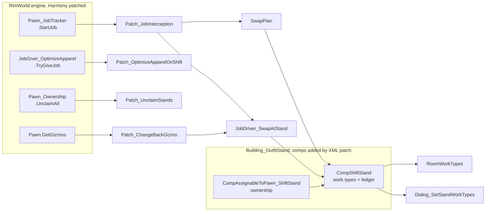

# Development

Build, debug and test loop. For why the mod is shaped the way it is, see
[DESIGN.md](DESIGN.md).

## Requirements

| | |
|---|---|
| .NET SDK | 8.0 or later. The project targets `net472`; `Microsoft.NETFramework.ReferenceAssemblies` supplies the targeting pack, so no Framework install is needed on macOS or Linux. |
| RimWorld | 1.6, with the Odyssey expansion. Optional for building, required for running and for engine navigation. |
| Harmony | The `brrainz.harmony` mod, at runtime only. Not vendored. |

## Build

```bash
dotnet build Source/ShiftChange/ShiftChange.csproj -c Release
```

Output goes straight to `Assemblies/`, which must contain exactly one file.
Release runs a `CleanDevArtifacts` target that deletes anything else it finds
there, including hot-reload leftovers.

## Install

Symlink the repository into the game's `Mods/` directory, then enable it in the
in-game mod list along with Harmony. Enable **Development mode** in Options to
get the debug log and god tools.

Def changes require a full game restart. Do not use vanilla's `Hot reload Defs`
or the community equivalent; both corrupt live state on a large mod list. C#
changes are a different story, see [Hot reload](#hot-reload) below.

## Engine navigation

RimWorld publishes no API documentation, so go-to-definition into the engine is
the reference. `F12` on any engine type decompiles it in place.

Two things have to line up:

1. The editor is allowed to decompile. In VS Code that is one setting, and
   `.vscode/` is gitignored, so add it yourself:

   ```json
   { "dotnet.navigation.navigateToDecompiledSources": true }
   ```

2. The build references assemblies that actually contain IL.

| References | Source | `F12` shows |
|---|---|---|
| `Assembly-CSharp.dll` from a local install | game folder | real decompiled bodies |
| `Krafs.Rimworld.Ref` | NuGet | signatures only, empty stubs |

The project picks between them on **install presence, not build configuration**:
if a RimWorld install is found, every configuration uses the real DLLs; if not,
it falls back to Krafs.

Overrides:

| Goal | Flag |
|---|---|
| Non-standard install location | `RimWorldManaged=/path/to/Managed` (env var or `-p:`) |
| Reproduce the CI build exactly | `-p:DisableLocalGameRefs=true` |

CI has no game install, so it always compiles against Krafs, and the release job
rebuilds before packaging — so the GitHub release zip is always the Krafs build.
The Workshop dll is not: `publish-workshop.sh` stages a local Release build,
which carries whichever references the machine resolved — the real DLLs wherever
an install is present. Same public surface either way.

## Hot reload

Debug builds compile in Zetrith's EditCompileReload: a rebuild swaps changed
method bodies into the running game. Release references none of it.

```bash
dotnet build Source/ShiftChange/ShiftChange.csproj -c Debug
```

`[ShiftChange] hot reload applied` in the dev log is the heartbeat. ECR's own
messages are prefixed `[ShiftChange/ECR]`.

**UI and layout only.** Behaviour (jobs, ledger, scribing) is verified on a
clean Release restart, never in a swapped session.

| | Live | Lab |
|---|---|---|
| Build | Release | Debug |
| On-screen badge | none | cyan, turns orange at first reload |
| Gameplay interception | full | full until first reload, then disabled |
| Saving | freely | never after a reload |

A Debug build behaves identically to Release until the first reload. The first
reload forks the session into a lab: gameplay interception disables itself and
the save is no longer trustworthy. Open a disposable save before iterating.

Rules that are not obvious:

- **Never build Release during a hot session.** The sweep deletes the
  `.dll_orig` the watcher polls, killing reload until relaunch.
- **Structural edits need a restart**: instance fields, constructors, attribute
  changes, virtuals. New types and static fields do swap.
- A session is capped at 64 reloads. The 65th needs a restart.

### Language rules the rig imposes

ECR loads each reload as a new assembly and redirects methods into it, so every
member access from a swapped body is cross-assembly. Unity's Mono does not
implement `IgnoresAccessChecksTo`, so the only mechanism that works is
`InternalsVisibleTo`, granted to the numbered twins in `HotReloadVisibility.cs`.

| Rule | Failure if broken |
|---|---|
| `internal`, never `private` | `FieldAccessException` at the first swapped access |
| No auto-properties | backing field is always private, no syntax widens it |
| No protected base members | `MethodAccessException`; mirror the value as an internal const instead |

Within a single-assembly mod, `internal` and `private` are equivalent in
practice, so this costs nothing. CI enforces the first two.

## Runtime knobs

Dev mode → **Tweak values** → `ShiftChange`. These are `static`, not `const`,
specifically so they are tunable in play.

| Field | Default | Effect |
|---|---|---|
| `Enabled` | `true` | Master switch for all interception |
| `Verbose` | `false` | Log every decision, not just swaps. Noisy. |
| `DressMidJob` | `true` | Mid-job catch-up when a stand frees up |
| `RetryCooldownTicks` | `600` | Minimum ticks before reconsidering a pawn whose swap could not start |

Mod settings carry one player-facing toggle, `poolUnassignedStands` (default
on). Settings live in vanilla's config file, so uninstalling leaves no trace in
a save.

Dev mode → **Shift Change** → **Build demo stage**, then click a cell: three
roofed rooms (hospital, laboratory, kitchen) with stocked stands, a
self-starting kitchen bill and three workers. This ships in Release deliberately.

## Testing

Behaviour is verified in game, on a clean Release restart. Two tools help.

**The demo stage** is the general fixture — a colony in one click, where a swap
can be watched end to end.

**The lifecycle harness** covers what the demo stage cannot: thirteen cases that
drive the engine's own entry points and assert where the ledger landed. What it
covers, what it deliberately does not, the rules it follows and the two engine
traps it had to pay for are all in [TESTING.md](TESTING.md).

```bash
devtools/run-harness.sh              # a four-mod list — the iteration loop
devtools/run-harness.sh --full       # your own mod list — the release gate
devtools/run-harness.sh --alongside  # a second instance beside a live game
```

One command, no hands: builds Release, launches an isolated instance, waits for
it to run every case and quit itself, prints the report, exits non-zero on
failure. Measured 2026-08-14, launch to process exit:

| Mod list | Wall clock |
|---|---|
| The four-mod list | ~20 s |
| `--full`, on a 233-entry list | ~160 s |
| Four-mod, alongside a live colony | ~25 s paused, several minutes if actively ticking |

Those are one machine's numbers; `--full` scales with whatever list is active,
since almost all of it is RimWorld's own load time.

**The four-mod list is for iterating; `--full` is what a release is signed off
on.** This mod patches a vanilla building other mods also touch, so the small
list is precisely the environment in which a conflict cannot appear.

### Driving it by hand

What you want when a case fails and you need to watch it: dev mode → **Shift
Change** → **Run lifecycle harness**, then click a clear 7×7 area. The debug
actions menu has a search box — type `lifecycle` and it filters to the single
entry, which beats hunting by eye, because the menu's layout shifts with the
mod list.

For a fast interactive session without the headless run,
`devtools/rimworld-profile.sh minimal` / `restore` swaps the live mod list. It
refuses while RimWorld is running: the game rewrites `ModsConfig.xml` on exit
and would undo the swap, or write the minimal list over the real one. It parks
your list once and restores it verbatim.

## CI

`.github/workflows/ci.yml`. Most of these checks exist because the codebase
broke that way once; the rest block a failure that would land silently.

| Check | Catches |
|---|---|
| `xmllint` well-formedness | malformed XML. Runs under `pipefail`, or a `find` that fails on a renamed directory drops a whole tree from validation with a green tick. |
| `devtools/check-invariants.py` | hot-reload hazards, translation keys in both directions, XML-to-C# type bindings, the `<Patch>` root walk, and the Workshop preview size. Runs locally too — see [TESTING.md](TESTING.md). |
| `devtools/bbcode-preview.py` | an unclosed tag in the store description, which makes Steam render the rest of the page as literal text |
| Committed dll is uninstrumented, and alone | an instrumented Debug build reaching the mod's load path |
| Release build | compile errors against Krafs |

The behavioural suite is **not** in CI and cannot be: it needs the game. It runs
on this machine, and `--full` is what a release is signed off on.

Tagging a commit `v*` additionally packages the mod folder and publishes a
GitHub release.

## Workshop upload

Deliberately manual, but **never through the dev symlink**. RimWorld's uploader
publishes the mod's folder verbatim: `Workshop.cs` hands `hook.Directory.FullName`
to `SteamUGC.SetItemContent`, `ModMetaData.GetWorkshopUploadDirectory()` returns
`RootDir` unfiltered, and `PrepareForWorkshopUpload()` has an empty body. Since
`Mods/ShiftChange` is a symlink to this repository, uploading through it ships
`Source/`, `media/`, `.github/` and the entire `.git` directory to subscribers.

```
devtools/publish-workshop.sh stage      # Release build + allowlist -> dist/
devtools/publish-workshop.sh install    # into Mods/, dev symlink removed
#   ... upload in game, then quit ...
devtools/publish-workshop.sh restore    # dev symlink back, item id recovered
```

Staged is ~1.1 MB against ~100 MB for the working tree — most of that is
`dist/testdata`, the harness's isolated save-data folder, which holds this
machine's own log and a copy of its mod list. `install` deletes the dev symlink
outright rather than parking it, because the game enumerates every directory
under `Mods/`, dot-prefixed or not, and two folders sharing `packageId` race
first-wins for which one the uploader publishes. `restore` recreates the link.

Two things the game does not upload, and one it does that matters:

- **The description comes from `About.xml`, not the BBCode.** `SetItemDescription`
  is called only on the create branch, so `media/steam-description.bbcode` has to
  be pasted into the Steam web editor by hand, and no later in-game update will
  push it. Get it right on day one; there is no second chance from inside the
  game.
- **Only `About/Preview.png` is uploaded.** `media/cards/*.png` need adding to the
  item's gallery in the browser, and the demo gif wants re-hosting on the item
  rather than hotlinked from imgur.
- **`About/PublishedFileId.txt` is written into the upload root** after a
  successful publish, and the create-vs-update branch keys off it. `restore`
  copies it back into the repo; commit it, or the next upload mints a duplicate
  listing instead of updating this one.

`publish-workshop.sh install` prints the browser checklist; follow it before
setting the item public.

### What goes in About.xml, and what does not

`About.xml`'s `<description>` is the in-game mod-list blurb — a small scrolling
panel answering "what does this do, and what does it need". It is not a store
page, and it is read by someone standing in the mod list, not browsing.

So it carries the things that change what a player does: the requirements, the
behaviour, the controls, and the apparel caveat (vanilla ships nothing worth
changing into, which is the first thing a new installer trips over).

It deliberately does **not** carry the meta: the AI-assistance disclosure, the
Ludeon trademark disclaimer, the source link as prose, or the gif. Those belong
on the surfaces where the mod is distributed — the Workshop page and the
README — which is where every one of them lives. Convention agrees: of 251
subscribed mods on this machine, **none** put the Ludeon disclaimer in
`About.xml`. The source link is in `About.xml` as `<url>`, which is the field
the game provides for exactly that and renders as a button.

## Logs

Dev log in game, or the full trace at:

```
~/Library/Logs/Ludeon Studios/RimWorld by Ludeon Studios/Player.log
```

Everything this mod writes is prefixed `[ShiftChange]`.

## File map



### `Source/ShiftChange/`

| File | Role |
|---|---|
| `Patch_JobInterception.cs` | Prefix on `StartJob`. Decides whether to divert, defers the original job, carries the mid-job catch-up. |
| `JobDriver_SwapAtStand.cs` | Moves apparel, one direction at a time. Sets the forced flag on the way in, clears it on the way out. |
| `SwapPlan.cs` | The single answer to "what would this swap move". Every wearability predicate lives here. |
| `CompShiftStand.cs` | Per-stand work types and the checkout ledger. Static registry of on-shift stands. |
| `CompAssignableToPawn_ShiftStand.cs` | Ownership. Narrows candidates to pawns capable of the stand's work. |
| `Patch_ChangeBackGizmo.cs` | "Change back" command on a pawn in uniform, plus the room-exit latch. |
| `Patch_OptimizeApparelOnShift.cs` | Pauses the vanilla wardrobe optimizer while a pawn is checked out. |
| `Patch_UnclaimStands.cs` | Releases stands when vanilla unclaims beds and thrones. Holds the reaper both it and the banish patch call. |
| `Patch_BanishStands.cs` | Calls the same reaper for banishment, the one colony exit vanilla routes past `UnclaimAll`. |
| `RoomWorkTypes.cs` | Room role to work type sets. Keyed by defName, silent-fail. |
| `Dialog_SetStandWorkTypes.cs` | Per-stand work type picker. |
| `ShiftChangeMod.cs` | Mod settings. |
| `ShiftChangeDefOf.cs` | Def references. |
| `SessionGuard.cs` | Clears session-scoped statics when the loaded game changes. Route any new static through it. |
| `HarmonyInit.cs` | Patch bootstrap. |
| `DebugTools_DemoStage.cs` | The demo stage. Test fixture and film set. |
| `DebugTools_PreviewStage.cs` | The title-card stage. Three standalone rooms sized to crop to Workshop cards. |
| `DebugTools_LifecycleHarness.cs` | The test suite. Thirteen cases driving real engine entry points — see [TESTING.md](TESTING.md). |
| `Patch_HarnessAutoRun.cs` | Runs the harness and quits, when launched with `-shiftchange-harness`. Inert without the flag. |
| `HotReloadVisibility.cs` | Debug only. `InternalsVisibleTo` grants for the reload twins. |
| `EcrWatchdog.cs` | Debug only. Polls for rebuilds, because Mono's `FileSystemWatcher` never fires on macOS. |
| `Patch_ModeBadge.cs` | Debug only. The on-screen live/lab badge. |

### Content

| Path | Contents |
|---|---|
| `About/About.xml` | Metadata, dependencies. `Preview.png` is needed only for Workshop upload. |
| `Defs/JobDefs/` | `ShiftChange_SwapAtStand`, the swap job, both directions. |
| `Patches/` | Adds the two comps to the vanilla outfit stand def. |
| `Languages/English/Keyed/` | Gizmo and inspect strings. |
| `Assemblies/` | Build output. Exactly one dll. |

### `devtools/`

Not shipped — the release allowlist is `About Assemblies Defs Patches Languages
docs LICENSE README.md`.

| Script | Does |
|---|---|
| `run-harness.sh` | Runs the test suite headless in an isolated instance. `--full`, `--alongside`. |
| `check-invariants.py` | The static checks CI runs. Run it before pushing. |
| `rimworld-profile.sh` | Swaps the live mod list for a fast interactive session. |
| `publish-workshop.sh` | Stages a Workshop upload out of the working tree, and swaps it into `Mods/`. |
| `bbcode-preview.py` | Validates the store description and renders a local preview. |
| `footage.sh` | Screen capture for the demo gif. |
